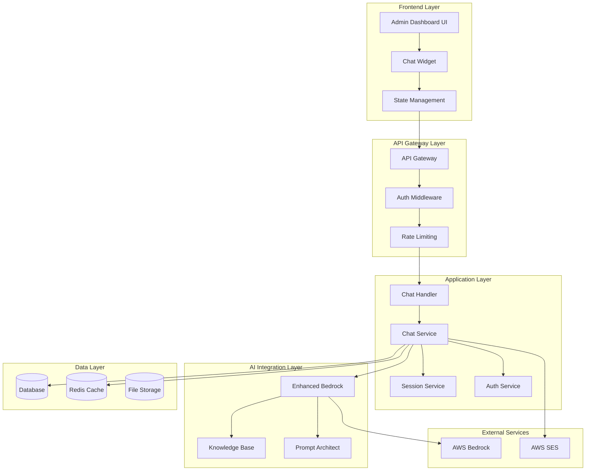

# Design Document

## Overview

The AI Consultant Assistant Live Chat system is designed to provide real-time AI-powered consulting assistance integrated seamlessly into the existing admin dashboard. The system leverages AWS Bedrock for AI capabilities, WebSocket connections for real-time communication, and the existing authentication and knowledge base infrastructure.

The design builds upon the current chat implementation while adding comprehensive session management, data persistence, enhanced security, and improved user experience. The system will serve as a productivity tool for consultants during client meetings, providing instant access to AWS expertise, cost estimates, and best practices.

## Architecture

### High-Level Architecture



### Component Architecture

The system follows a layered architecture with clear separation of concerns:

1. **Presentation Layer**: React-based chat widget integrated into the admin dashboard
2. **API Layer**: RESTful endpoints and WebSocket handlers for real-time communication
3. **Business Logic Layer**: Chat services, session management, and AI integration
4. **Data Access Layer**: Database repositories and caching mechanisms
5. **External Integration Layer**: AWS Bedrock, SES, and other external services

## Components and Interfaces

### Frontend Components

#### ChatWidget Component
- **Purpose**: Main chat interface integrated into admin dashboard
- **Features**: 
  - Persistent chat widget across dashboard pages
  - Minimizable/expandable interface
  - Real-time message display
  - Quick action buttons for common queries
  - Session context management
- **State Management**: Redux/Context API for chat state
- **WebSocket Integration**: Real-time bidirectional communication

#### ChatSessionManager
- **Purpose**: Manages chat session lifecycle and state
- **Responsibilities**:
  - Session creation and restoration
  - Message history management
  - Connection state monitoring
  - Automatic reconnection handling

#### ChatMessageList
- **Purpose**: Displays chat messages with proper formatting
- **Features**:
  - Message type differentiation (user/assistant/system)
  - Timestamp display
  - Message status indicators
  - Auto-scroll to latest messages
  - Message search and filtering

### Backend Components

#### ChatHandler (Enhanced)
```go
type ChatHandler struct {
    chatService     interfaces.ChatService
    sessionService  interfaces.SessionService
    authService     interfaces.AuthService
    logger          *logrus.Logger
    wsUpgrader      websocket.Upgrader
    rateLimiter     interfaces.RateLimiter
}
```

#### ChatService
```go
type ChatService interface {
    CreateSession(ctx context.Context, userID string, metadata *SessionMetadata) (*ChatSession, error)
    SendMessage(ctx context.Context, sessionID string, message *ChatMessage) (*ChatResponse, error)
    GetSessionHistory(ctx context.Context, sessionID string, limit int) ([]*ChatMessage, error)
    UpdateSessionContext(ctx context.Context, sessionID string, context *SessionContext) error
    CloseSession(ctx context.Context, sessionID string) error
    GetActiveSessions(ctx context.Context, userID string) ([]*ChatSession, error)
}
```

#### SessionService
```go
type SessionService interface {
    CreateSession(ctx context.Context, session *ChatSession) error
    GetSession(ctx context.Context, sessionID string) (*ChatSession, error)
    UpdateSession(ctx context.Context, session *ChatSession) error
    DeleteSession(ctx context.Context, sessionID string) error
    CleanupExpiredSessions(ctx context.Context) error
    GetUserSessions(ctx context.Context, userID string) ([]*ChatSession, error)
}
```

#### AIIntegrationService
```go
type AIIntegrationService interface {
    GenerateChatResponse(ctx context.Context, request *ChatRequest) (*ChatResponse, error)
    GetContextualPrompt(ctx context.Context, session *ChatSession, message string) (string, error)
    ProcessQuickAction(ctx context.Context, action string, context *SessionContext) (string, error)
    ValidateResponse(response string) error
}
```

### API Endpoints

#### REST Endpoints
- `POST /api/v1/admin/chat/sessions` - Create new chat session
- `GET /api/v1/admin/chat/sessions` - List user's chat sessions
- `GET /api/v1/admin/chat/sessions/{id}` - Get specific session
- `PUT /api/v1/admin/chat/sessions/{id}` - Update session context
- `DELETE /api/v1/admin/chat/sessions/{id}` - Delete session
- `GET /api/v1/admin/chat/sessions/{id}/history` - Get message history
- `POST /api/v1/admin/chat/sessions/{id}/messages` - Send message (fallback)

#### WebSocket Endpoint
- `GET /api/v1/admin/chat/ws` - WebSocket connection for real-time chat

### Real-Time Communication

#### WebSocket Message Protocol
```json
{
  "type": "message|typing|status|error",
  "session_id": "string",
  "message_id": "string",
  "content": "string",
  "metadata": {
    "client_name": "string",
    "context": "string",
    "quick_action": "string"
  },
  "timestamp": "ISO8601"
}
```

#### Connection Management
- Automatic reconnection with exponential backoff
- Connection health monitoring with heartbeat
- Graceful degradation to HTTP polling if WebSocket fails
- Connection pooling and load balancing support

## Data Models

### ChatSession
```go
type ChatSession struct {
    ID           string                 `json:"id" db:"id"`
    UserID       string                 `json:"user_id" db:"user_id"`
    ClientName   string                 `json:"client_name" db:"client_name"`
    Context      string                 `json:"context" db:"context"`
    Status       SessionStatus          `json:"status" db:"status"`
    Metadata     map[string]interface{} `json:"metadata" db:"metadata"`
    CreatedAt    time.Time              `json:"created_at" db:"created_at"`
    UpdatedAt    time.Time              `json:"updated_at" db:"updated_at"`
    LastActivity time.Time              `json:"last_activity" db:"last_activity"`
    ExpiresAt    *time.Time             `json:"expires_at" db:"expires_at"`
}
```

### ChatMessage
```go
type ChatMessage struct {
    ID        string                 `json:"id" db:"id"`
    SessionID string                 `json:"session_id" db:"session_id"`
    Type      MessageType            `json:"type" db:"type"`
    Content   string                 `json:"content" db:"content"`
    Metadata  map[string]interface{} `json:"metadata" db:"metadata"`
    CreatedAt time.Time              `json:"created_at" db:"created_at"`
    Status    MessageStatus          `json:"status" db:"status"`
}
```

### SessionContext
```go
type SessionContext struct {
    ClientName      string            `json:"client_name"`
    MeetingType     string            `json:"meeting_type"`
    ProjectContext  string            `json:"project_context"`
    ServiceTypes    []string          `json:"service_types"`
    CloudProviders  []string          `json:"cloud_providers"`
    CustomFields    map[string]string `json:"custom_fields"`
}
```

## Error Handling

### Error Categories
1. **Connection Errors**: WebSocket disconnections, network issues
2. **Authentication Errors**: Invalid tokens, expired sessions
3. **Validation Errors**: Invalid message format, missing required fields
4. **AI Service Errors**: Bedrock API failures, rate limiting
5. **Database Errors**: Connection failures, constraint violations

### Error Response Format
```json
{
  "error": {
    "code": "CHAT_ERROR_CODE",
    "message": "Human-readable error message",
    "details": {
      "field": "specific error details"
    },
    "retry_after": 30,
    "correlation_id": "uuid"
  }
}
```

### Retry and Fallback Strategies
- Exponential backoff for connection retries
- Circuit breaker pattern for AI service calls
- Graceful degradation to cached responses
- Offline message queuing with sync on reconnection

## Testing Strategy

### Unit Testing
- **Frontend**: Jest + React Testing Library
  - Component rendering and interaction
  - State management logic
  - WebSocket message handling
  - Error boundary behavior

- **Backend**: Go testing framework
  - Service layer business logic
  - Repository data access patterns
  - WebSocket handler functionality
  - AI integration service mocking

### Integration Testing
- **API Testing**: Postman/Newman for REST endpoints
- **WebSocket Testing**: Custom test clients for real-time communication
- **Database Testing**: Test containers with PostgreSQL
- **AI Integration Testing**: Mock Bedrock responses for consistent testing

### End-to-End Testing
- **User Workflows**: Cypress for complete chat scenarios
- **Cross-browser Testing**: Multiple browser compatibility
- **Mobile Responsiveness**: Touch interaction and responsive design
- **Performance Testing**: Load testing with multiple concurrent sessions

### Test Data Management
- **Fixtures**: Predefined chat sessions and messages
- **Factories**: Dynamic test data generation
- **Cleanup**: Automated test data cleanup after test runs
- **Isolation**: Each test runs with isolated data

## Security Considerations

### Authentication and Authorization
- **JWT Token Validation**: All chat requests require valid admin tokens
- **Session-based Authorization**: Users can only access their own chat sessions
- **Role-based Access Control**: Different chat features based on user roles
- **Token Refresh**: Automatic token refresh for long-running sessions

### Data Protection
- **Encryption in Transit**: TLS 1.3 for all communications
- **Encryption at Rest**: Database-level encryption for sensitive chat data
- **Data Anonymization**: PII scrubbing in logs and analytics
- **Data Retention**: Configurable retention policies for chat history

### Input Validation and Sanitization
- **Message Content**: XSS prevention and content filtering
- **File Uploads**: Virus scanning and type validation (if implemented)
- **Rate Limiting**: Per-user and per-session message limits
- **Content Moderation**: Automated filtering of inappropriate content

### Audit and Monitoring
- **Access Logging**: All chat access and modifications logged
- **Security Events**: Failed authentication attempts and suspicious activity
- **Data Access Tracking**: Who accessed what chat data when
- **Compliance Reporting**: GDPR/CCPA compliance reporting capabilities

## Performance Optimization

### Frontend Optimization
- **Virtual Scrolling**: Efficient rendering of large message histories
- **Message Pagination**: Load messages on demand to reduce initial load time
- **Debounced Input**: Reduce unnecessary API calls during typing
- **Caching Strategy**: Local storage for session data and recent messages

### Backend Optimization
- **Connection Pooling**: Efficient database connection management
- **Message Queuing**: Asynchronous processing of non-critical operations
- **Caching Layer**: Redis for session data and frequently accessed information
- **Database Indexing**: Optimized queries for message retrieval and search

### AI Integration Optimization
- **Response Caching**: Cache similar queries to reduce Bedrock API calls
- **Prompt Optimization**: Efficient prompt engineering to minimize token usage
- **Batch Processing**: Group similar requests when possible
- **Fallback Responses**: Pre-generated responses for common queries

## Deployment and Infrastructure

### Infrastructure Requirements
- **WebSocket Support**: Load balancer configuration for WebSocket connections
- **Database**: PostgreSQL with appropriate indexing and partitioning
- **Cache**: Redis cluster for session management and caching
- **Monitoring**: CloudWatch/Prometheus for metrics and alerting

### Deployment Strategy
- **Blue-Green Deployment**: Zero-downtime deployments with WebSocket considerations
- **Database Migrations**: Automated schema migrations with rollback capability
- **Configuration Management**: Environment-specific configuration handling
- **Health Checks**: Comprehensive health checks for all components

### Scaling Considerations
- **Horizontal Scaling**: Multiple backend instances with session affinity
- **Database Sharding**: Partition chat data by user or time for large scale
- **CDN Integration**: Static asset delivery optimization
- **Auto-scaling**: Dynamic scaling based on concurrent connection metrics

## Monitoring and Observability

### Metrics Collection
- **Connection Metrics**: Active connections, connection duration, reconnection rates
- **Message Metrics**: Messages per second, response times, error rates
- **AI Metrics**: Bedrock API usage, response quality, token consumption
- **User Metrics**: Active users, session duration, feature usage

### Logging Strategy
- **Structured Logging**: JSON format with correlation IDs
- **Log Levels**: Appropriate log levels for different environments
- **Sensitive Data**: Ensure no PII or sensitive data in logs
- **Log Aggregation**: Centralized logging with search and analysis capabilities

### Alerting
- **Error Rate Alerts**: High error rates or service failures
- **Performance Alerts**: Response time degradation or high latency
- **Capacity Alerts**: High connection counts or resource utilization
- **Security Alerts**: Suspicious activity or security events

This design provides a comprehensive foundation for implementing the AI consultant assistant live chat system while maintaining security, performance, and scalability requirements.