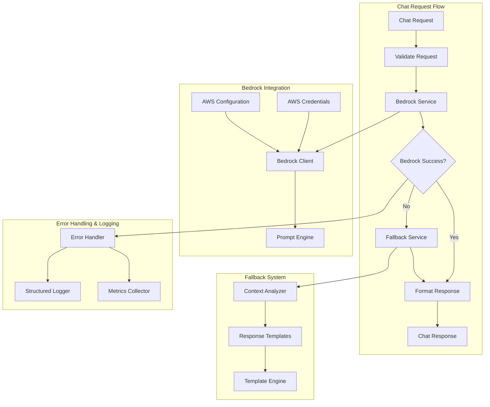
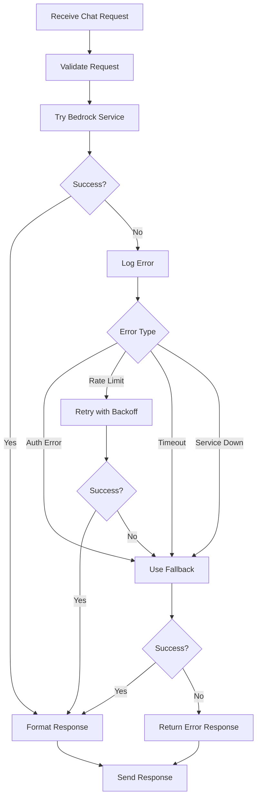

# Design Document

## Overview

This design addresses the critical issue where the AI chat system returns empty responses due to disabled Bedrock integration. The solution implements a robust AWS Bedrock service integration as the primary response mechanism, with intelligent fallback responses as a safety net.

**Key Design Principles:**
1. **Primary Bedrock Integration** - Restore and properly configure AWS Bedrock as the main AI service
2. **Intelligent Fallbacks** - Implement context-aware fallback responses when Bedrock is unavailable
3. **Seamless Error Handling** - Ensure users always receive meaningful responses
4. **Professional Quality** - All responses must be suitable for client presentations

## Architecture

### High-Level Architecture



### Component Interactions

1. **Request Processing**: Validate and prepare chat requests
2. **Bedrock Integration**: Primary AI service for generating responses
3. **Fallback System**: Intelligent backup when Bedrock fails
4. **Error Handling**: Comprehensive logging and error recovery
5. **Response Formatting**: Consistent response structure

## Components and Interfaces

### Bedrock Service Interface

```go
type BedrockService interface {
    // Initialize the Bedrock client with AWS credentials
    Initialize(ctx context.Context, config *BedrockConfig) error
    
    // Generate AI response using Bedrock
    GenerateResponse(ctx context.Context, prompt string, options *GenerationOptions) (*BedrockResponse, error)
    
    // Check if Bedrock service is available
    HealthCheck(ctx context.Context) error
    
    // Get service metrics
    GetMetrics() *BedrockMetrics
}

type BedrockConfig struct {
    Region          string `json:"region"`
    ModelID         string `json:"model_id"`
    AccessKeyID     string `json:"access_key_id,omitempty"`
    SecretAccessKey string `json:"secret_access_key,omitempty"`
    SessionToken    string `json:"session_token,omitempty"`
    Endpoint        string `json:"endpoint,omitempty"`
    MaxRetries      int    `json:"max_retries"`
    Timeout         time.Duration `json:"timeout"`
}

type GenerationOptions struct {
    MaxTokens     int     `json:"max_tokens"`
    Temperature   float64 `json:"temperature"`
    TopP          float64 `json:"top_p"`
    StopSequences []string `json:"stop_sequences,omitempty"`
}

type BedrockResponse struct {
    Content      string            `json:"content"`
    TokensUsed   int              `json:"tokens_used"`
    FinishReason string           `json:"finish_reason"`
    Metadata     map[string]interface{} `json:"metadata"`
}

type BedrockMetrics struct {
    TotalRequests    int64         `json:"total_requests"`
    SuccessfulRequests int64       `json:"successful_requests"`
    FailedRequests   int64         `json:"failed_requests"`
    AverageLatency   time.Duration `json:"average_latency"`
    LastError        string        `json:"last_error,omitempty"`
    LastErrorTime    time.Time     `json:"last_error_time,omitempty"`
}
```

### Fallback Response Service

```go
type FallbackService interface {
    // Generate intelligent fallback response
    GenerateResponse(ctx context.Context, userMessage string) (*FallbackResponse, error)
    
    // Analyze message context to determine response type
    AnalyzeContext(message string) *MessageContext
    
    // Get available response templates
    GetTemplates() map[string]*ResponseTemplate
    
    // Update response templates
    UpdateTemplates(templates map[string]*ResponseTemplate) error
}

type MessageContext struct {
    Category    string   `json:"category"`    // "security", "cost", "architecture", "migration", "general"
    Keywords    []string `json:"keywords"`
    Confidence  float64  `json:"confidence"`
    AWSServices []string `json:"aws_services,omitempty"`
    Industry    string   `json:"industry,omitempty"`
}

type ResponseTemplate struct {
    ID          string            `json:"id"`
    Category    string            `json:"category"`
    Template    string            `json:"template"`
    Variables   map[string]string `json:"variables"`
    Keywords    []string          `json:"keywords"`
    Priority    int               `json:"priority"`
}

type FallbackResponse struct {
    Content     string         `json:"content"`
    Category    string         `json:"category"`
    Confidence  float64        `json:"confidence"`
    TemplateID  string         `json:"template_id"`
    IsFallback  bool           `json:"is_fallback"`
}
```

### Enhanced Chat Handler

```go
type EnhancedChatHandler struct {
    bedrockService BedrockService
    fallbackService FallbackService
    logger         *logrus.Logger
    metrics        *MetricsCollector
    config         *ChatConfig
}

type ChatConfig struct {
    BedrockEnabled      bool          `json:"bedrock_enabled"`
    FallbackEnabled     bool          `json:"fallback_enabled"`
    MaxResponseTime     time.Duration `json:"max_response_time"`
    RetryAttempts       int           `json:"retry_attempts"`
    EnableMetrics       bool          `json:"enable_metrics"`
}

// Enhanced message handling with Bedrock integration
func (h *EnhancedChatHandler) HandleMessage(c *gin.Context) {
    // 1. Validate request
    // 2. Try Bedrock service
    // 3. Fall back if needed
    // 4. Format and return response
}
```

## Data Models

### Enhanced Chat Message

```go
type EnhancedChatMessage struct {
    ID          string                 `json:"id"`
    Content     string                 `json:"content"`
    Role        string                 `json:"role"`
    Timestamp   time.Time              `json:"timestamp"`
    SessionID   string                 `json:"session_id"`
    
    // Enhanced fields
    ResponseSource string             `json:"response_source"` // "bedrock", "fallback"
    TokensUsed     int                `json:"tokens_used,omitempty"`
    ResponseTime   time.Duration      `json:"response_time"`
    Category       string             `json:"category,omitempty"`
    Confidence     float64            `json:"confidence,omitempty"`
    Metadata       map[string]interface{} `json:"metadata,omitempty"`
}
```

### Error Response Structure

```go
type ChatError struct {
    Code        string    `json:"code"`
    Message     string    `json:"message"`
    Details     string    `json:"details,omitempty"`
    Timestamp   time.Time `json:"timestamp"`
    RequestID   string    `json:"request_id"`
    Retryable   bool      `json:"retryable"`
}

// Error codes
const (
    ErrCodeBedrockUnavailable    = "BEDROCK_UNAVAILABLE"
    ErrCodeBedrockTimeout        = "BEDROCK_TIMEOUT"
    ErrCodeBedrockInvalidResponse = "BEDROCK_INVALID_RESPONSE"
    ErrCodeBedrockAuthError      = "BEDROCK_AUTH_ERROR"
    ErrCodeFallbackFailed        = "FALLBACK_FAILED"
    ErrCodeInvalidRequest        = "INVALID_REQUEST"
)
```

## Error Handling

### Error Handling Strategy

1. **Bedrock Service Errors**
   - Authentication errors → Log and use fallback
   - Rate limiting → Implement exponential backoff
   - Service unavailable → Switch to fallback immediately
   - Invalid responses → Validate and retry once

2. **Fallback Service Errors**
   - Template missing → Use default template
   - Context analysis failed → Use general response
   - All fallbacks failed → Return error message

3. **Network and Infrastructure Errors**
   - Timeout → Retry with shorter timeout
   - Connection refused → Switch to fallback
   - DNS resolution → Log and use fallback

### Error Recovery Flow



## Testing Strategy

### Unit Testing

1. **Bedrock Service Tests**
   - AWS credential validation
   - API request/response handling
   - Error condition handling
   - Retry logic validation

2. **Fallback Service Tests**
   - Context analysis accuracy
   - Template selection logic
   - Response generation quality
   - Edge case handling

3. **Integration Tests**
   - End-to-end chat flow
   - Bedrock to fallback switching
   - Error recovery scenarios
   - Performance under load

### Test Scenarios

```go
type TestScenario struct {
    Name            string
    UserMessage     string
    BedrockEnabled  bool
    BedrockResponse *BedrockResponse
    BedrockError    error
    ExpectedSource  string // "bedrock" or "fallback"
    ExpectedCategory string
    MinResponseLength int
}

var testScenarios = []TestScenario{
    {
        Name:            "Bedrock Success - Security Question",
        UserMessage:     "What are the security best practices for AWS?",
        BedrockEnabled:  true,
        BedrockResponse: &BedrockResponse{Content: "AWS security best practices include..."},
        ExpectedSource:  "bedrock",
        ExpectedCategory: "security",
        MinResponseLength: 100,
    },
    {
        Name:            "Bedrock Failure - Fallback Success",
        UserMessage:     "How can I optimize AWS costs?",
        BedrockEnabled:  true,
        BedrockError:    errors.New("service unavailable"),
        ExpectedSource:  "fallback",
        ExpectedCategory: "cost",
        MinResponseLength: 50,
    },
    // More scenarios...
}
```

## Implementation Considerations

### AWS Bedrock Configuration

1. **Model Selection**
   - Primary: Claude 3 Sonnet for balanced performance and cost
   - Alternative: Claude 3 Haiku for faster responses
   - Fallback: GPT-3.5 Turbo if available

2. **Prompt Engineering**
   - System prompt for AWS consulting context
   - User message preprocessing
   - Response post-processing for consistency

3. **Performance Optimization**
   - Connection pooling for AWS SDK
   - Response caching for similar queries
   - Async processing for non-blocking operations

### Fallback Response Templates

```go
var fallbackTemplates = map[string]*ResponseTemplate{
    "security": {
        ID:       "security-001",
        Category: "security",
        Template: `AWS security best practices include: implementing the principle of least privilege with IAM, enabling AWS CloudTrail for audit logging, using AWS Config for compliance monitoring, encrypting data at rest and in transit, and implementing network security with VPCs and security groups. For compliance frameworks like SOC 2, HIPAA, or PCI DSS, AWS provides specific guidance and services. What specific security concerns would you like to address?`,
        Keywords: []string{"security", "compliance", "encryption", "IAM", "audit"},
        Priority: 1,
    },
    "cost": {
        ID:       "cost-001", 
        Category: "cost",
        Template: `For AWS cost optimization, I recommend starting with the AWS Cost Calculator to estimate your workload costs. Key strategies include: using Reserved Instances for predictable workloads, implementing auto-scaling to match demand, leveraging S3 storage classes for data lifecycle management, and regularly reviewing your AWS Cost and Usage Reports. Would you like me to elaborate on any of these cost optimization strategies?`,
        Keywords: []string{"cost", "pricing", "optimization", "savings", "budget"},
        Priority: 1,
    },
    // More templates...
}
```

### Monitoring and Observability

1. **Metrics Collection**
   - Response times (Bedrock vs Fallback)
   - Success/failure rates
   - Token usage and costs
   - User satisfaction indicators

2. **Logging Strategy**
   - Structured logging with correlation IDs
   - Error categorization and alerting
   - Performance monitoring
   - Usage analytics

3. **Health Checks**
   - Bedrock service availability
   - AWS credential validity
   - Fallback service functionality
   - Overall system health

This design ensures that users always receive meaningful, professional responses while providing robust error handling and monitoring capabilities.