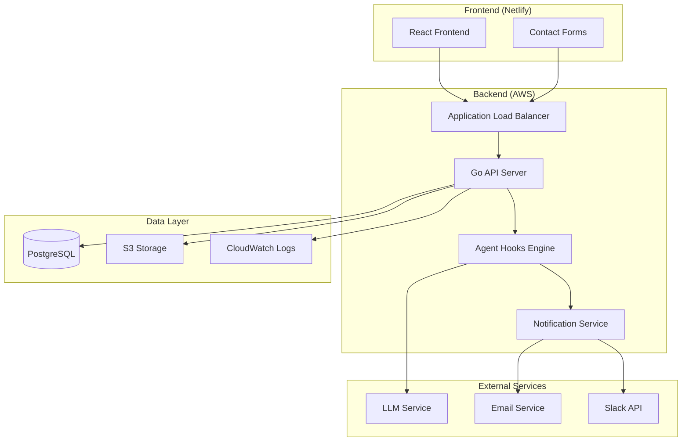
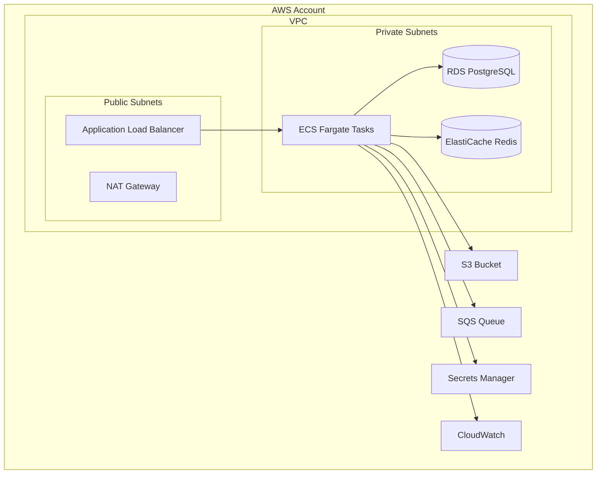
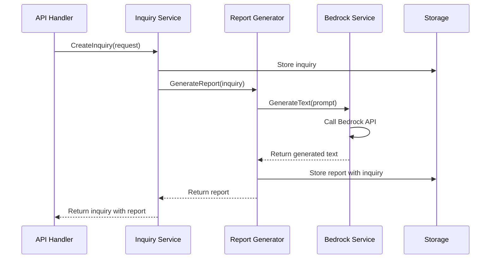

# Design Document

## Overview

The cloud consulting backend is a Go-based RESTful API system that processes service inquiries from the React frontend, automatically categorizes them, generates AI-powered draft reports, and manages consultant notifications. The system follows a microservices-inspired architecture with clear separation of concerns, supporting four main service types: Assessment, Migration, Optimization, and Architecture Review.

The backend integrates with the existing Netlify-hosted React frontend (which currently uses Formik forms and styled-components) and is designed for secure AWS deployment with horizontal scaling capabilities. The system emphasizes extensibility through plugin-based architecture and maintains comprehensive documentation in plain text format for AI tool compatibility.

## Architecture

### High-Level Architecture



### Service Architecture

The backend follows a layered architecture pattern:

1. **API Layer**: HTTP handlers and middleware
2. **Service Layer**: Business logic and orchestration
3. **Repository Layer**: Data access abstraction
4. **Infrastructure Layer**: External service integrations

### Technology Stack

- **Runtime**: Go 1.21+
- **Web Framework**: Gin (lightweight, high-performance)
- **AI Service**: Amazon Bedrock Nova model with API key authentication
- **Database**: PostgreSQL with GORM ORM (future iteration)
- **Storage**: In-memory storage (current), AWS S3 for document storage (future)
- **HTTP Client**: Standard Go net/http for Bedrock API calls
- **Configuration**: Environment variables for API keys and settings
- **Monitoring**: Basic logging (current), Prometheus metrics + CloudWatch (future)
- **Deployment**: Local development (current), Docker containers on AWS ECS/EKS (future)

## Components and Interfaces

### Core Components

#### 1. Inquiry Service
Handles incoming service requests and categorization.

```go
type InquiryService interface {
    CreateInquiry(ctx context.Context, req *CreateInquiryRequest) (*Inquiry, error)
    GetInquiry(ctx context.Context, id string) (*Inquiry, error)
    ListInquiries(ctx context.Context, filters *InquiryFilters) ([]*Inquiry, error)
    UpdateInquiryStatus(ctx context.Context, id string, status InquiryStatus) error
}

type CreateInquiryRequest struct {
    Name        string   `json:"name" validate:"required,min=2,max=50"`
    Email       string   `json:"email" validate:"required,email"`
    Company     string   `json:"company,omitempty"`
    Phone       string   `json:"phone,omitempty"`
    Services    []string `json:"services" validate:"required,min=1"`
    Message     string   `json:"message" validate:"required,min=1"`
    Source      string   `json:"source,omitempty"`
    UTMParams   map[string]string `json:"utm_params,omitempty"`
}
```

#### 2. Agent Hooks Engine
Manages automated report generation and workflow triggers.

```go
type AgentHooksEngine interface {
    RegisterHook(hookType HookType, handler HookHandler) error
    TriggerHook(ctx context.Context, hookType HookType, payload interface{}) error
    ListActiveHooks() []HookInfo
}

type HookHandler interface {
    Execute(ctx context.Context, payload interface{}) (*HookResult, error)
    GetMetadata() HookMetadata
}

type ReportGeneratorHook struct {
    llmService LLMService
    storage    StorageService
}
```

#### 3. Notification Service
Handles consultant notifications and communication.

```go
type NotificationService interface {
    SendNotification(ctx context.Context, notification *Notification) error
    RegisterChannel(channel NotificationChannel) error
    GetDeliveryStatus(notificationID string) (*DeliveryStatus, error)
}

type NotificationChannel interface {
    Send(ctx context.Context, message *Message) error
    GetChannelType() ChannelType
    IsHealthy() bool
}
```

#### 4. Report Generator
AI-powered draft report generation using Amazon Bedrock.

```go
type ReportGenerator interface {
    GenerateReport(ctx context.Context, inquiry *Inquiry) (*Report, error)
    GetReportTemplate(serviceType ServiceType) (*Template, error)
    ValidateReport(report *Report) error
}

type BedrockService interface {
    GenerateText(ctx context.Context, prompt string, options *BedrockOptions) (*BedrockResponse, error)
    GetModelInfo() BedrockModelInfo
    IsHealthy() bool
}

type BedrockOptions struct {
    ModelID     string  `json:"modelId"`
    MaxTokens   int     `json:"maxTokens"`
    Temperature float64 `json:"temperature"`
    TopP        float64 `json:"topP"`
}

type BedrockResponse struct {
    Content   string            `json:"content"`
    Usage     BedrockUsage      `json:"usage"`
    Metadata  map[string]string `json:"metadata"`
}

type BedrockUsage struct {
    InputTokens  int `json:"inputTokens"`
    OutputTokens int `json:"outputTokens"`
}
```

### API Endpoints

#### Inquiry Management
- `POST /api/v1/inquiries` - Create new inquiry
- `GET /api/v1/inquiries/{id}` - Get inquiry details
- `GET /api/v1/inquiries` - List inquiries with filters
- `PUT /api/v1/inquiries/{id}/status` - Update inquiry status
- `GET /api/v1/inquiries/{id}/report` - Get generated report

#### System Management
- `GET /api/v1/health` - Health check endpoint
- `GET /api/v1/metrics` - Prometheus metrics
- `POST /api/v1/hooks/trigger` - Manual hook trigger
- `GET /api/v1/hooks` - List active hooks

#### Configuration
- `GET /api/v1/config/services` - Get available service types
- `PUT /api/v1/config/services` - Update service configuration
- `GET /api/v1/config/notifications` - Get notification settings

## Data Models

### Core Entities

#### Inquiry Model
```go
type Inquiry struct {
    ID          string                 `json:"id" gorm:"primaryKey"`
    Name        string                 `json:"name" gorm:"not null"`
    Email       string                 `json:"email" gorm:"not null"`
    Company     string                 `json:"company"`
    Phone       string                 `json:"phone"`
    Services    pq.StringArray         `json:"services" gorm:"type:text[]"`
    Message     string                 `json:"message" gorm:"not null"`
    Status      InquiryStatus          `json:"status" gorm:"default:'pending'"`
    Priority    Priority               `json:"priority" gorm:"default:'medium'"`
    Source      string                 `json:"source"`
    UTMParams   datatypes.JSON         `json:"utm_params"`
    AssignedTo  *string                `json:"assigned_to"`
    CreatedAt   time.Time              `json:"created_at"`
    UpdatedAt   time.Time              `json:"updated_at"`
    
    // Relationships
    Reports     []Report               `json:"reports,omitempty"`
    Activities  []Activity             `json:"activities,omitempty"`
}

type InquiryStatus string
const (
    StatusPending    InquiryStatus = "pending"
    StatusProcessing InquiryStatus = "processing"
    StatusReviewed   InquiryStatus = "reviewed"
    StatusResponded  InquiryStatus = "responded"
    StatusClosed     InquiryStatus = "closed"
)
```

#### Report Model
```go
type Report struct {
    ID          string          `json:"id" gorm:"primaryKey"`
    InquiryID   string          `json:"inquiry_id" gorm:"not null"`
    Type        ReportType      `json:"type" gorm:"not null"`
    Title       string          `json:"title" gorm:"not null"`
    Content     string          `json:"content" gorm:"type:text"`
    Status      ReportStatus    `json:"status" gorm:"default:'draft'"`
    GeneratedBy string          `json:"generated_by"`
    ReviewedBy  *string         `json:"reviewed_by"`
    S3Key       string          `json:"s3_key"`
    Metadata    datatypes.JSON  `json:"metadata"`
    CreatedAt   time.Time       `json:"created_at"`
    UpdatedAt   time.Time       `json:"updated_at"`
    
    // Relationships
    Inquiry     Inquiry         `json:"inquiry,omitempty"`
}
```

#### Activity Log Model
```go
type Activity struct {
    ID          string          `json:"id" gorm:"primaryKey"`
    InquiryID   string          `json:"inquiry_id" gorm:"not null"`
    Type        ActivityType    `json:"type" gorm:"not null"`
    Description string          `json:"description" gorm:"not null"`
    Actor       string          `json:"actor"`
    Metadata    datatypes.JSON  `json:"metadata"`
    CreatedAt   time.Time       `json:"created_at"`
    
    // Relationships
    Inquiry     Inquiry         `json:"inquiry,omitempty"`
}
```

### Database Schema

```sql
-- Inquiries table
CREATE TABLE inquiries (
    id VARCHAR(36) PRIMARY KEY DEFAULT gen_random_uuid(),
    name VARCHAR(100) NOT NULL,
    email VARCHAR(255) NOT NULL,
    company VARCHAR(255),
    phone VARCHAR(50),
    services TEXT[] NOT NULL,
    message TEXT NOT NULL,
    status VARCHAR(20) DEFAULT 'pending',
    priority VARCHAR(20) DEFAULT 'medium',
    source VARCHAR(100),
    utm_params JSONB,
    assigned_to VARCHAR(36),
    created_at TIMESTAMP DEFAULT NOW(),
    updated_at TIMESTAMP DEFAULT NOW()
);

-- Reports table
CREATE TABLE reports (
    id VARCHAR(36) PRIMARY KEY DEFAULT gen_random_uuid(),
    inquiry_id VARCHAR(36) NOT NULL REFERENCES inquiries(id),
    type VARCHAR(50) NOT NULL,
    title VARCHAR(255) NOT NULL,
    content TEXT,
    status VARCHAR(20) DEFAULT 'draft',
    generated_by VARCHAR(100),
    reviewed_by VARCHAR(36),
    s3_key VARCHAR(500),
    metadata JSONB,
    created_at TIMESTAMP DEFAULT NOW(),
    updated_at TIMESTAMP DEFAULT NOW()
);

-- Activity logs table
CREATE TABLE activities (
    id VARCHAR(36) PRIMARY KEY DEFAULT gen_random_uuid(),
    inquiry_id VARCHAR(36) NOT NULL REFERENCES inquiries(id),
    type VARCHAR(50) NOT NULL,
    description TEXT NOT NULL,
    actor VARCHAR(100),
    metadata JSONB,
    created_at TIMESTAMP DEFAULT NOW()
);

-- Indexes for performance
CREATE INDEX idx_inquiries_status ON inquiries(status);
CREATE INDEX idx_inquiries_created_at ON inquiries(created_at);
CREATE INDEX idx_inquiries_email ON inquiries(email);
CREATE INDEX idx_reports_inquiry_id ON reports(inquiry_id);
CREATE INDEX idx_activities_inquiry_id ON activities(inquiry_id);
```

## Error Handling

### Error Types and Responses

```go
type APIError struct {
    Code    string `json:"code"`
    Message string `json:"message"`
    Details string `json:"details,omitempty"`
    TraceID string `json:"trace_id,omitempty"`
}

// Standard error codes
const (
    ErrCodeValidation     = "VALIDATION_ERROR"
    ErrCodeNotFound       = "NOT_FOUND"
    ErrCodeUnauthorized   = "UNAUTHORIZED"
    ErrCodeRateLimit      = "RATE_LIMIT_EXCEEDED"
    ErrCodeInternal       = "INTERNAL_ERROR"
    ErrCodeServiceUnavail = "SERVICE_UNAVAILABLE"
)
```

### Error Handling Strategy

1. **Input Validation**: Use struct tags and validator library
2. **Business Logic Errors**: Custom error types with context
3. **Infrastructure Errors**: Wrapped errors with retry logic
4. **API Errors**: Standardized JSON error responses
5. **Logging**: Structured logging with correlation IDs

### Retry and Circuit Breaker Patterns

```go
type CircuitBreaker interface {
    Execute(ctx context.Context, fn func() error) error
    GetState() CircuitState
}

type RetryConfig struct {
    MaxAttempts int
    BackoffFunc func(attempt int) time.Duration
    RetryIf     func(error) bool
}
```

## Testing Strategy

### Testing Pyramid

1. **Unit Tests (70%)**
   - Service layer logic
   - Data validation
   - Business rules
   - Utility functions

2. **Integration Tests (20%)**
   - Database operations
   - External service integrations
   - API endpoint testing
   - Hook execution flows

3. **End-to-End Tests (10%)**
   - Complete inquiry processing flow
   - Report generation pipeline
   - Notification delivery
   - Error scenarios

### Test Structure

```go
// Unit test example
func TestInquiryService_CreateInquiry(t *testing.T) {
    tests := []struct {
        name    string
        request *CreateInquiryRequest
        want    *Inquiry
        wantErr bool
    }{
        {
            name: "valid inquiry",
            request: &CreateInquiryRequest{
                Name:     "John Doe",
                Email:    "john@example.com",
                Services: []string{"assessment"},
                Message:  "Need cloud assessment",
            },
            wantErr: false,
        },
        // More test cases...
    }
    
    for _, tt := range tests {
        t.Run(tt.name, func(t *testing.T) {
            // Test implementation
        })
    }
}
```

### Testing Tools

- **Unit Testing**: Go standard testing package + testify
- **Mocking**: gomock for interface mocking
- **Database Testing**: testcontainers for PostgreSQL
- **HTTP Testing**: httptest package
- **Load Testing**: k6 for performance testing

### Continuous Testing

- **Pre-commit hooks**: Run tests and linting
- **CI Pipeline**: Automated test execution on PR
- **Coverage Requirements**: Minimum 80% code coverage
- **Integration Testing**: Automated testing against staging environment

## Deployment and Infrastructure

### Containerization

```dockerfile
# Multi-stage Dockerfile
FROM golang:1.21-alpine AS builder
WORKDIR /app
COPY go.mod go.sum ./
RUN go mod download
COPY . .
RUN CGO_ENABLED=0 GOOS=linux go build -o main ./cmd/server

FROM alpine:latest
RUN apk --no-cache add ca-certificates
WORKDIR /root/
COPY --from=builder /app/main .
EXPOSE 8080
CMD ["./main"]
```

### AWS Infrastructure



### Infrastructure as Code

```yaml
# docker-compose.yml for local development
version: '3.8'
services:
  api:
    build: .
    ports:
      - "8080:8080"
    environment:
      - DATABASE_URL=postgres://user:pass@db:5432/consulting
      - REDIS_URL=redis://redis:6379
    depends_on:
      - db
      - redis
  
  db:
    image: postgres:15
    environment:
      POSTGRES_DB: consulting
      POSTGRES_USER: user
      POSTGRES_PASSWORD: pass
    volumes:
      - postgres_data:/var/lib/postgresql/data
  
  redis:
    image: redis:7-alpine
    
volumes:
  postgres_data:
```

## Amazon Bedrock Integration

### Authentication and Configuration

The system uses Amazon Bedrock API keys for authentication, configured via environment variables:

```go
type BedrockConfig struct {
    APIKey    string `env:"AWS_BEARER_TOKEN_BEDROCK,required"`
    Region    string `env:"BEDROCK_REGION" envDefault:"us-east-1"`
    ModelID   string `env:"BEDROCK_MODEL_ID" envDefault:"amazon.nova-lite-v1:0"`
    BaseURL   string `env:"BEDROCK_BASE_URL" envDefault:"https://bedrock-runtime.us-east-1.amazonaws.com"`
    Timeout   int    `env:"BEDROCK_TIMEOUT_SECONDS" envDefault:"30"`
}
```

### Report Generation Flow



### Prompt Engineering

The system uses structured prompts based on service type:

```go
func (r *reportGenerator) buildPrompt(inquiry *Inquiry) string {
    template := `Generate a professional consulting report draft for the following client inquiry:

Client: %s (%s)
Company: %s
Services Requested: %s
Message: %s

Please provide a structured report with:
1. Executive Summary
2. Current State Assessment
3. Recommendations
4. Next Steps

Keep the tone professional and focus on actionable insights.`

    return fmt.Sprintf(template, 
        inquiry.Name, 
        inquiry.Email, 
        inquiry.Company, 
        strings.Join(inquiry.Services, ", "), 
        inquiry.Message)
}
```

### Error Handling and Resilience

- **Graceful Degradation**: If Bedrock fails, inquiry is still created without report
- **Timeout Handling**: 30-second timeout for Bedrock API calls
- **Retry Logic**: Single retry on network errors
- **Error Logging**: Detailed logging of Bedrock API failures

### Security Considerations

1. **API Key Security**: Store AWS_BEARER_TOKEN_BEDROCK in environment variables only
2. **Data Privacy**: Client data sent to Bedrock is not stored by AWS (per Bedrock terms)
3. **Rate Limiting**: Respect Bedrock API rate limits
4. **Input Sanitization**: Clean inquiry data before sending to Bedrock
5. **HTTPS Only**: All Bedrock API calls use HTTPS
6. **Audit Logging**: Log all Bedrock API calls with inquiry IDs

### Monitoring and Observability

```go
// Metrics collection
type Metrics struct {
    InquiriesCreated    prometheus.Counter
    ReportsGenerated    prometheus.Counter
    NotificationsSent   prometheus.Counter
    ResponseTime        prometheus.Histogram
    ErrorRate          prometheus.Counter
}
```

- **Metrics**: Prometheus + Grafana dashboards
- **Logging**: Structured JSON logs to CloudWatch
- **Tracing**: OpenTelemetry for distributed tracing
- **Alerting**: CloudWatch alarms for critical metrics
- **Health Checks**: Kubernetes-style health endpoints