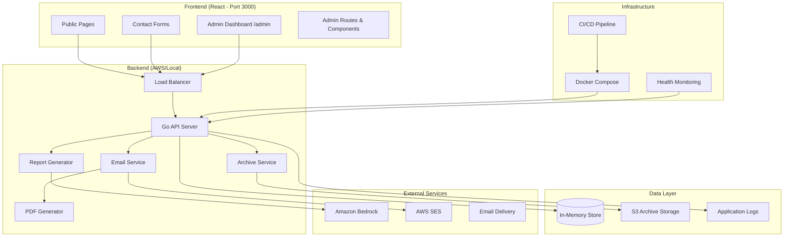
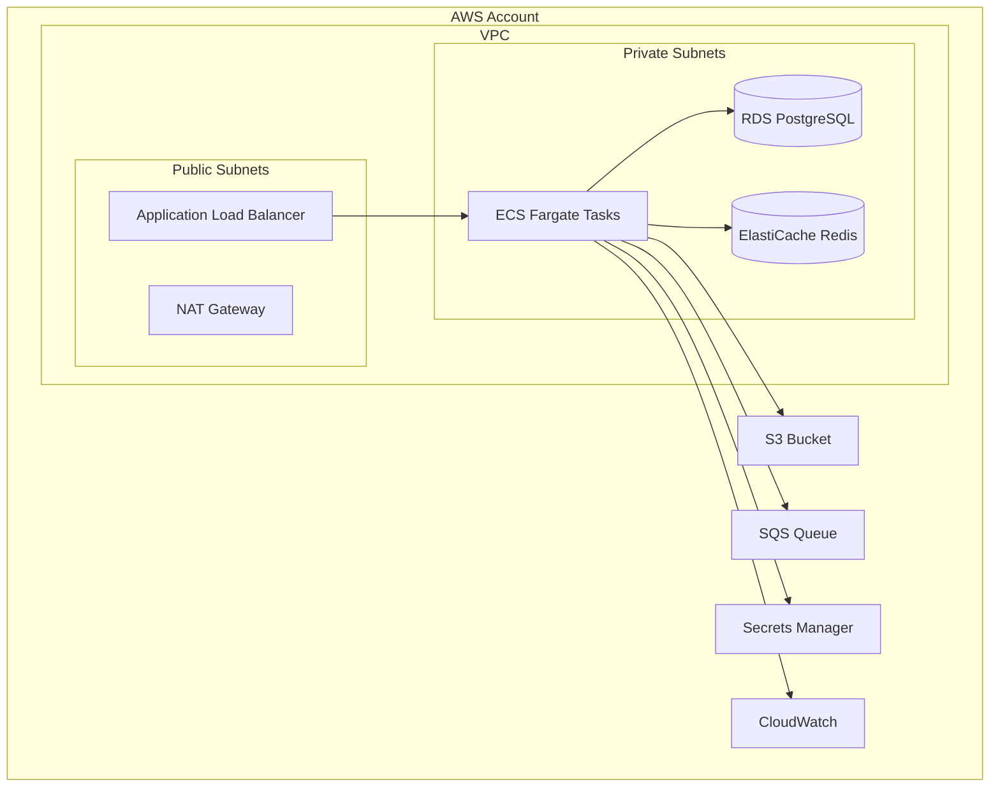
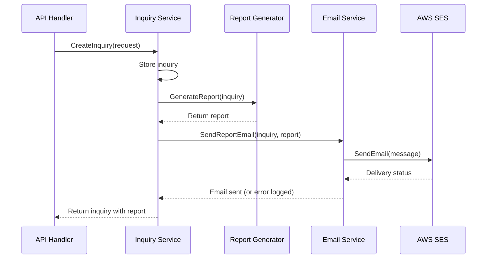
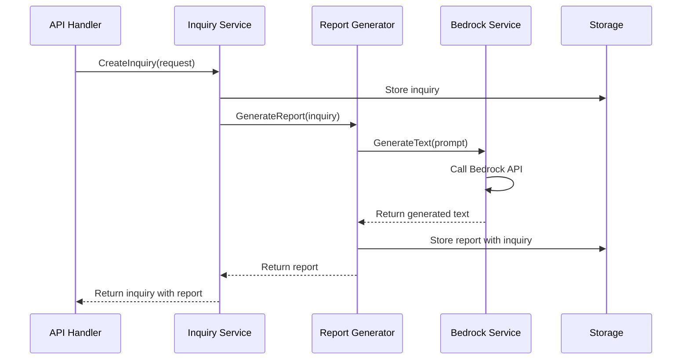
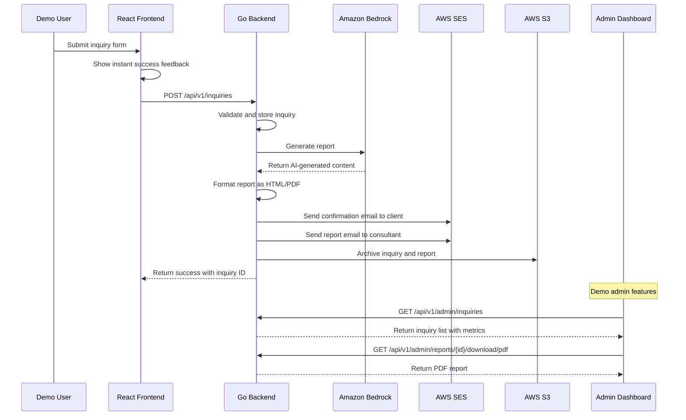

# Design Document

## Overview

The cloud consulting backend is a comprehensive Go-based platform that transforms client inquiries into professional AI-powered consulting reports with full business automation. The system processes service inquiries from the React frontend, generates branded reports with HTML/PDF output, provides admin dashboards for monitoring, and maintains secure archival to AWS S3 for compliance.

The platform is designed for hackathon demo excellence with polished UX, professional email communications, robust infrastructure, and comprehensive documentation. It supports four main service types: Assessment, Migration, Optimization, and Architecture Review, with full end-to-end automation from inquiry submission to report delivery and archival.

The backend integrates seamlessly with the existing Netlify-hosted React frontend and includes enhanced features for demo impact: instant feedback, branded communications, admin monitoring, automated archival, and production-ready infrastructure with CI/CD pipelines.

## Architecture

### High-Level Architecture



### Service Architecture

The backend follows a layered architecture pattern:

1. **API Layer**: HTTP handlers and middleware
2. **Service Layer**: Business logic and orchestration
3. **Repository Layer**: Data access abstraction
4. **Infrastructure Layer**: External service integrations

### Technology Stack

- **Runtime**: Go 1.21+
- **Web Framework**: Gin with enhanced middleware (CORS, logging, recovery, rate limiting)
- **AI Service**: Amazon Bedrock Nova model with API key authentication
- **Storage**: In-memory storage with AWS S3 archival integration
- **Email**: AWS SES with HTML/PDF generation capabilities
- **PDF Generation**: wkhtmltopdf or similar for professional report formatting
- **Template Engine**: Go html/template for branded email templates
- **HTTP Client**: Standard Go net/http with retry logic and circuit breakers
- **Configuration**: Environment variables with validation and defaults
- **Containerization**: Docker with multi-stage builds and Docker Compose
- **CI/CD**: GitHub Actions or similar with automated testing and deployment
- **Monitoring**: Structured logging with health checks and metrics endpoints
- **Security**: Input validation, rate limiting, and secure credential management

## Components and Interfaces

### Core Components

#### 1. Enhanced Inquiry Service
Handles incoming service requests with professional feedback and validation.

```go
type InquiryService interface {
    CreateInquiry(ctx context.Context, req *CreateInquiryRequest) (*Inquiry, error)
    GetInquiry(ctx context.Context, id string) (*Inquiry, error)
    ListInquiries(ctx context.Context, filters *InquiryFilters) ([]*Inquiry, error)
    UpdateInquiryStatus(ctx context.Context, id string, status InquiryStatus) error
}

type CreateInquiryRequest struct {
    Name        string   `json:"name" validate:"required,min=2,max=50"`
    Email       string   `json:"email" validate:"required,email"`
    Company     string   `json:"company,omitempty"`
    Phone       string   `json:"phone,omitempty"`
    Services    []string `json:"services" validate:"required,min=1"`
    Message     string   `json:"message" validate:"required,min=1"`
    Source      string   `json:"source,omitempty"`
    UTMParams   map[string]string `json:"utm_params,omitempty"`
}
```

#### 2. Agent Hooks Engine
Manages automated report generation and workflow triggers.

```go
type AgentHooksEngine interface {
    RegisterHook(hookType HookType, handler HookHandler) error
    TriggerHook(ctx context.Context, hookType HookType, payload interface{}) error
    ListActiveHooks() []HookInfo
}

type HookHandler interface {
    Execute(ctx context.Context, payload interface{}) (*HookResult, error)
    GetMetadata() HookMetadata
}

type ReportGeneratorHook struct {
    llmService LLMService
    storage    StorageService
}
```

#### 3. Email Notification Service
Handles email notifications using AWS SES for report delivery.

```go
type EmailService interface {
    SendReportEmail(ctx context.Context, inquiry *Inquiry, report *Report) error
    SendInquiryNotification(ctx context.Context, inquiry *Inquiry) error
    IsHealthy() bool
}

type SESService interface {
    SendEmail(ctx context.Context, email *EmailMessage) error
    VerifyEmailAddress(ctx context.Context, email string) error
    GetSendingQuota(ctx context.Context) (*SendingQuota, error)
}

type EmailMessage struct {
    From        string   `json:"from"`
    To          []string `json:"to"`
    Subject     string   `json:"subject"`
    TextBody    string   `json:"text_body"`
    HTMLBody    string   `json:"html_body,omitempty"`
    ReplyTo     string   `json:"reply_to,omitempty"`
}

type SendingQuota struct {
    Max24HourSend   float64 `json:"max_24_hour_send"`
    MaxSendRate     float64 `json:"max_send_rate"`
    SentLast24Hours float64 `json:"sent_last_24_hours"`
}
```

#### 4. Enhanced Report Generator
AI-powered report generation with HTML/PDF output and professional formatting.

```go
type ReportGenerator interface {
    GenerateReport(ctx context.Context, inquiry *Inquiry) (*Report, error)
    GenerateHTML(ctx context.Context, report *Report) (string, error)
    GeneratePDF(ctx context.Context, htmlContent string) ([]byte, error)
    GetReportTemplate(serviceType ServiceType) (*Template, error)
    ValidateReport(report *Report) error
}

type PDFGenerator interface {
    GeneratePDF(ctx context.Context, htmlContent string, options *PDFOptions) ([]byte, error)
    IsHealthy() bool
}

type PDFOptions struct {
    PageSize    string `json:"page_size"`
    Orientation string `json:"orientation"`
    Margins     Margins `json:"margins"`
    Header      string `json:"header,omitempty"`
    Footer      string `json:"footer,omitempty"`
}

type Margins struct {
    Top    string `json:"top"`
    Right  string `json:"right"`
    Bottom string `json:"bottom"`
    Left   string `json:"left"`
}
```

#### 5. Admin Service
Provides administrative endpoints for monitoring and management.

```go
type AdminService interface {
    ListInquiries(ctx context.Context, filters *AdminFilters) (*InquiryList, error)
    GetInquiryDetails(ctx context.Context, id string) (*InquiryDetails, error)
    GetSystemMetrics(ctx context.Context) (*SystemMetrics, error)
    GetEmailDeliveryStatus(ctx context.Context, inquiryID string) (*EmailStatus, error)
    DownloadReport(ctx context.Context, inquiryID string, format ReportFormat) ([]byte, error)
}

type AdminFilters struct {
    Status     *InquiryStatus `json:"status,omitempty"`
    DateFrom   *time.Time     `json:"date_from,omitempty"`
    DateTo     *time.Time     `json:"date_to,omitempty"`
    ServiceType *string       `json:"service_type,omitempty"`
    Limit      int            `json:"limit"`
    Offset     int            `json:"offset"`
}

type SystemMetrics struct {
    TotalInquiries      int64   `json:"total_inquiries"`
    ReportsGenerated    int64   `json:"reports_generated"`
    EmailsSent          int64   `json:"emails_sent"`
    EmailDeliveryRate   float64 `json:"email_delivery_rate"`
    AvgReportGenTime    float64 `json:"avg_report_gen_time_ms"`
    SystemUptime        string  `json:"system_uptime"`
    LastProcessedAt     *time.Time `json:"last_processed_at"`
}
```

#### 6. Archive Service
Handles automated archival to AWS S3 for compliance and audit purposes.

```go
type ArchiveService interface {
    ArchiveInquiry(ctx context.Context, inquiry *Inquiry) error
    ArchiveReport(ctx context.Context, report *Report, formats []ReportFormat) error
    RetrieveArchive(ctx context.Context, key string) ([]byte, error)
    ListArchives(ctx context.Context, prefix string) ([]ArchiveItem, error)
    IsHealthy() bool
}

type S3Service interface {
    Upload(ctx context.Context, key string, data []byte, contentType string) error
    Download(ctx context.Context, key string) ([]byte, error)
    List(ctx context.Context, prefix string) ([]S3Object, error)
    Delete(ctx context.Context, key string) error
}

type ArchiveItem struct {
    Key          string    `json:"key"`
    Size         int64     `json:"size"`
    LastModified time.Time `json:"last_modified"`
    ContentType  string    `json:"content_type"`
}

type S3Object struct {
    Key          string    `json:"key"`
    Size         int64     `json:"size"`
    LastModified time.Time `json:"last_modified"`
    ETag         string    `json:"etag"`
}
```

#### 7. Template Service
Manages branded email and report templates.

```go
type TemplateService interface {
    RenderEmailTemplate(ctx context.Context, templateName string, data interface{}) (string, error)
    RenderReportTemplate(ctx context.Context, templateName string, data interface{}) (string, error)
    LoadTemplate(templateName string) (*template.Template, error)
    ValidateTemplate(templateContent string) error
}

type EmailTemplate struct {
    Name        string `json:"name"`
    Subject     string `json:"subject"`
    HTMLContent string `json:"html_content"`
    TextContent string `json:"text_content"`
    Variables   []string `json:"variables"`
}

type ReportTemplate struct {
    Name        string `json:"name"`
    ServiceType string `json:"service_type"`
    HTMLContent string `json:"html_content"`
    CSSStyles   string `json:"css_styles"`
    Variables   []string `json:"variables"`
}
```

```go
type ReportGenerator interface {
    GenerateReport(ctx context.Context, inquiry *Inquiry) (*Report, error)
    GetReportTemplate(serviceType ServiceType) (*Template, error)
    ValidateReport(report *Report) error
}

type BedrockService interface {
    GenerateText(ctx context.Context, prompt string, options *BedrockOptions) (*BedrockResponse, error)
    GetModelInfo() BedrockModelInfo
    IsHealthy() bool
}

type BedrockOptions struct {
    ModelID     string  `json:"modelId"`
    MaxTokens   int     `json:"maxTokens"`
    Temperature float64 `json:"temperature"`
    TopP        float64 `json:"topP"`
}

type BedrockResponse struct {
    Content   string            `json:"content"`
    Usage     BedrockUsage      `json:"usage"`
    Metadata  map[string]string `json:"metadata"`
}

type BedrockUsage struct {
    InputTokens  int `json:"inputTokens"`
    OutputTokens int `json:"outputTokens"`
}
```

### API Endpoints

#### Public Inquiry Management
- `POST /api/v1/inquiries` - Create new inquiry with instant feedback
- `GET /api/v1/inquiries/{id}` - Get inquiry details
- `GET /api/v1/inquiries/{id}/report` - Get generated report
- `GET /api/v1/inquiries/{id}/report/download` - Download report (HTML/PDF)

#### Admin Dashboard
- `GET /api/v1/admin/inquiries` - List all inquiries with filtering and pagination
- `GET /api/v1/admin/inquiries/{id}` - Get detailed inquiry information
- `GET /api/v1/admin/metrics` - Get system metrics and statistics
- `GET /api/v1/admin/email-status/{inquiryId}` - Get email delivery status
- `GET /api/v1/admin/reports/{id}/download/{format}` - Download reports in various formats

#### Archive Management
- `GET /api/v1/admin/archives` - List archived items
- `GET /api/v1/admin/archives/{key}` - Retrieve specific archive
- `POST /api/v1/admin/archives/manual` - Manually trigger archival

#### System Management
- `GET /api/v1/health` - Comprehensive health check with dependency status
- `GET /api/v1/metrics` - Prometheus-compatible metrics
- `GET /api/v1/version` - API version and build information

#### Configuration
- `GET /api/v1/config/services` - Get available service types with descriptions
- `GET /api/v1/config/templates` - Get available email and report templates
- `GET /api/v1/config/system` - Get system configuration (non-sensitive)

## Data Models

### Core Entities

#### Inquiry Model
```go
type Inquiry struct {
    ID          string                 `json:"id" gorm:"primaryKey"`
    Name        string                 `json:"name" gorm:"not null"`
    Email       string                 `json:"email" gorm:"not null"`
    Company     string                 `json:"company"`
    Phone       string                 `json:"phone"`
    Services    pq.StringArray         `json:"services" gorm:"type:text[]"`
    Message     string                 `json:"message" gorm:"not null"`
    Status      InquiryStatus          `json:"status" gorm:"default:'pending'"`
    Priority    Priority               `json:"priority" gorm:"default:'medium'"`
    Source      string                 `json:"source"`
    UTMParams   datatypes.JSON         `json:"utm_params"`
    AssignedTo  *string                `json:"assigned_to"`
    CreatedAt   time.Time              `json:"created_at"`
    UpdatedAt   time.Time              `json:"updated_at"`
    
    // Relationships
    Reports     []Report               `json:"reports,omitempty"`
    Activities  []Activity             `json:"activities,omitempty"`
}

type InquiryStatus string
const (
    StatusPending    InquiryStatus = "pending"
    StatusProcessing InquiryStatus = "processing"
    StatusReviewed   InquiryStatus = "reviewed"
    StatusResponded  InquiryStatus = "responded"
    StatusClosed     InquiryStatus = "closed"
)
```

#### Report Model
```go
type Report struct {
    ID          string          `json:"id" gorm:"primaryKey"`
    InquiryID   string          `json:"inquiry_id" gorm:"not null"`
    Type        ReportType      `json:"type" gorm:"not null"`
    Title       string          `json:"title" gorm:"not null"`
    Content     string          `json:"content" gorm:"type:text"`
    Status      ReportStatus    `json:"status" gorm:"default:'draft'"`
    GeneratedBy string          `json:"generated_by"`
    ReviewedBy  *string         `json:"reviewed_by"`
    S3Key       string          `json:"s3_key"`
    Metadata    datatypes.JSON  `json:"metadata"`
    CreatedAt   time.Time       `json:"created_at"`
    UpdatedAt   time.Time       `json:"updated_at"`
    
    // Relationships
    Inquiry     Inquiry         `json:"inquiry,omitempty"`
}
```

#### Activity Log Model
```go
type Activity struct {
    ID          string          `json:"id" gorm:"primaryKey"`
    InquiryID   string          `json:"inquiry_id" gorm:"not null"`
    Type        ActivityType    `json:"type" gorm:"not null"`
    Description string          `json:"description" gorm:"not null"`
    Actor       string          `json:"actor"`
    Metadata    datatypes.JSON  `json:"metadata"`
    CreatedAt   time.Time       `json:"created_at"`
    
    // Relationships
    Inquiry     Inquiry         `json:"inquiry,omitempty"`
}
```

### Database Schema

```sql
-- Inquiries table
CREATE TABLE inquiries (
    id VARCHAR(36) PRIMARY KEY DEFAULT gen_random_uuid(),
    name VARCHAR(100) NOT NULL,
    email VARCHAR(255) NOT NULL,
    company VARCHAR(255),
    phone VARCHAR(50),
    services TEXT[] NOT NULL,
    message TEXT NOT NULL,
    status VARCHAR(20) DEFAULT 'pending',
    priority VARCHAR(20) DEFAULT 'medium',
    source VARCHAR(100),
    utm_params JSONB,
    assigned_to VARCHAR(36),
    created_at TIMESTAMP DEFAULT NOW(),
    updated_at TIMESTAMP DEFAULT NOW()
);

-- Reports table
CREATE TABLE reports (
    id VARCHAR(36) PRIMARY KEY DEFAULT gen_random_uuid(),
    inquiry_id VARCHAR(36) NOT NULL REFERENCES inquiries(id),
    type VARCHAR(50) NOT NULL,
    title VARCHAR(255) NOT NULL,
    content TEXT,
    status VARCHAR(20) DEFAULT 'draft',
    generated_by VARCHAR(100),
    reviewed_by VARCHAR(36),
    s3_key VARCHAR(500),
    metadata JSONB,
    created_at TIMESTAMP DEFAULT NOW(),
    updated_at TIMESTAMP DEFAULT NOW()
);

-- Activity logs table
CREATE TABLE activities (
    id VARCHAR(36) PRIMARY KEY DEFAULT gen_random_uuid(),
    inquiry_id VARCHAR(36) NOT NULL REFERENCES inquiries(id),
    type VARCHAR(50) NOT NULL,
    description TEXT NOT NULL,
    actor VARCHAR(100),
    metadata JSONB,
    created_at TIMESTAMP DEFAULT NOW()
);

-- Indexes for performance
CREATE INDEX idx_inquiries_status ON inquiries(status);
CREATE INDEX idx_inquiries_created_at ON inquiries(created_at);
CREATE INDEX idx_inquiries_email ON inquiries(email);
CREATE INDEX idx_reports_inquiry_id ON reports(inquiry_id);
CREATE INDEX idx_activities_inquiry_id ON activities(inquiry_id);
```

## Error Handling

### Error Types and Responses

```go
type APIError struct {
    Code    string `json:"code"`
    Message string `json:"message"`
    Details string `json:"details,omitempty"`
    TraceID string `json:"trace_id,omitempty"`
}

// Standard error codes
const (
    ErrCodeValidation     = "VALIDATION_ERROR"
    ErrCodeNotFound       = "NOT_FOUND"
    ErrCodeUnauthorized   = "UNAUTHORIZED"
    ErrCodeRateLimit      = "RATE_LIMIT_EXCEEDED"
    ErrCodeInternal       = "INTERNAL_ERROR"
    ErrCodeServiceUnavail = "SERVICE_UNAVAILABLE"
)
```

### Error Handling Strategy

1. **Input Validation**: Use struct tags and validator library
2. **Business Logic Errors**: Custom error types with context
3. **Infrastructure Errors**: Wrapped errors with retry logic
4. **API Errors**: Standardized JSON error responses
5. **Logging**: Structured logging with correlation IDs

### Retry and Circuit Breaker Patterns

```go
type CircuitBreaker interface {
    Execute(ctx context.Context, fn func() error) error
    GetState() CircuitState
}

type RetryConfig struct {
    MaxAttempts int
    BackoffFunc func(attempt int) time.Duration
    RetryIf     func(error) bool
}
```

## Testing Strategy

### Testing Pyramid

1. **Unit Tests (70%)**
   - Service layer logic
   - Data validation
   - Business rules
   - Utility functions

2. **Integration Tests (20%)**
   - Database operations
   - External service integrations
   - API endpoint testing
   - Hook execution flows

3. **End-to-End Tests (10%)**
   - Complete inquiry processing flow
   - Report generation pipeline
   - Notification delivery
   - Error scenarios

### Test Structure

```go
// Unit test example
func TestInquiryService_CreateInquiry(t *testing.T) {
    tests := []struct {
        name    string
        request *CreateInquiryRequest
        want    *Inquiry
        wantErr bool
    }{
        {
            name: "valid inquiry",
            request: &CreateInquiryRequest{
                Name:     "John Doe",
                Email:    "john@example.com",
                Services: []string{"assessment"},
                Message:  "Need cloud assessment",
            },
            wantErr: false,
        },
        // More test cases...
    }
    
    for _, tt := range tests {
        t.Run(tt.name, func(t *testing.T) {
            // Test implementation
        })
    }
}
```

### Testing Tools

- **Unit Testing**: Go standard testing package + testify
- **Mocking**: gomock for interface mocking
- **Database Testing**: testcontainers for PostgreSQL
- **HTTP Testing**: httptest package
- **Load Testing**: k6 for performance testing

### Continuous Testing

- **Pre-commit hooks**: Run tests and linting
- **CI Pipeline**: Automated test execution on PR
- **Coverage Requirements**: Minimum 80% code coverage
- **Integration Testing**: Automated testing against staging environment

## Deployment and Infrastructure

### Enhanced Containerization

```dockerfile
# Multi-stage Dockerfile with PDF generation support
FROM golang:1.21-alpine AS builder
WORKDIR /app
COPY go.mod go.sum ./
RUN go mod download
COPY . .
RUN CGO_ENABLED=0 GOOS=linux go build -o main ./cmd/server

FROM alpine:latest
# Install dependencies for PDF generation
RUN apk --no-cache add ca-certificates wkhtmltopdf xvfb ttf-dejavu
WORKDIR /root/
COPY --from=builder /app/main .
COPY templates/ ./templates/
COPY static/ ./static/
EXPOSE 8080
HEALTHCHECK --interval=30s --timeout=3s --start-period=5s --retries=3 \
  CMD wget --no-verbose --tries=1 --spider http://localhost:8080/api/v1/health || exit 1
CMD ["./main"]
```

### Enhanced Docker Compose Integration

The system will extend the existing Docker Compose setup (backend on port 8061, frontend on port 3000) with additional services and enhanced configuration:

```yaml
# Enhancements to existing docker-compose.yml
version: '3.8'
services:
  backend:
    # Existing backend service enhanced with new features
    environment:
      - AWS_BEARER_TOKEN_BEDROCK=${AWS_BEARER_TOKEN_BEDROCK}
      - AWS_ACCESS_KEY_ID=${AWS_ACCESS_KEY_ID}
      - AWS_SECRET_ACCESS_KEY=${AWS_SECRET_ACCESS_KEY}
      - SES_SENDER_EMAIL=${SES_SENDER_EMAIL}
      - S3_BUCKET_NAME=${S3_BUCKET_NAME}
      - S3_REGION=${AWS_REGION}
      - ENABLE_PDF_GENERATION=true
      - ENABLE_S3_ARCHIVAL=true
    volumes:
      - ./backend/templates:/app/templates
      - ./backend/static:/app/static
      - backend_logs:/app/logs

  frontend:
    # Existing frontend service with admin dashboard routes
    environment:
      - REACT_APP_API_URL=http://localhost:8061
      - REACT_APP_ENABLE_ADMIN=true
      - REACT_APP_ADMIN_PATH=/admin

  # Optional services for enhanced development
  mailhog:
    image: mailhog/mailhog:latest
    ports:
      - "1025:1025"  # SMTP
      - "8025:8025"  # Web UI
    profiles: ["development", "testing"]

  localstack:
    image: localstack/localstack:latest
    ports:
      - "4566:4566"
    environment:
      - SERVICES=s3,ses
      - DEBUG=1
    volumes:
      - localstack_data:/tmp/localstack
    profiles: ["development", "testing"]

volumes:
  backend_logs:
  localstack_data:
```

### AWS Infrastructure



### CI/CD Pipeline

```yaml
# .github/workflows/ci.yml
name: CI/CD Pipeline

on:
  push:
    branches: [ main, develop ]
  pull_request:
    branches: [ main ]

jobs:
  test:
    runs-on: ubuntu-latest
    steps:
    - uses: actions/checkout@v3
    
    - name: Set up Go
      uses: actions/setup-go@v3
      with:
        go-version: 1.21
    
    - name: Cache Go modules
      uses: actions/cache@v3
      with:
        path: ~/go/pkg/mod
        key: ${{ runner.os }}-go-${{ hashFiles('**/go.sum') }}
    
    - name: Install dependencies
      run: go mod download
    
    - name: Run linting
      uses: golangci/golangci-lint-action@v3
      with:
        version: latest
    
    - name: Run tests
      run: go test -v -race -coverprofile=coverage.out ./...
    
    - name: Upload coverage
      uses: codecov/codecov-action@v3
      with:
        file: ./coverage.out

  build:
    needs: test
    runs-on: ubuntu-latest
    steps:
    - uses: actions/checkout@v3
    
    - name: Build Docker image
      run: docker build -t cloud-consulting-backend .
    
    - name: Test Docker image
      run: |
        docker run -d --name test-container -p 8080:8080 cloud-consulting-backend
        sleep 10
        curl -f http://localhost:8080/api/v1/health || exit 1
        docker stop test-container

  integration-test:
    needs: build
    runs-on: ubuntu-latest
    steps:
    - uses: actions/checkout@v3
    
    - name: Run integration tests
      run: |
        docker-compose -f docker-compose.test.yml up -d
        sleep 30
        ./scripts/run-integration-tests.sh
        docker-compose -f docker-compose.test.yml down
```

### Monitoring and Observability

```go
// Enhanced health check with dependency status
type HealthStatus struct {
    Status      string                 `json:"status"`
    Version     string                 `json:"version"`
    Timestamp   time.Time              `json:"timestamp"`
    Uptime      string                 `json:"uptime"`
    Dependencies map[string]DepHealth  `json:"dependencies"`
    Metrics     HealthMetrics          `json:"metrics"`
}

type DepHealth struct {
    Status      string        `json:"status"`
    ResponseTime time.Duration `json:"response_time_ms"`
    LastChecked time.Time     `json:"last_checked"`
    Error       string        `json:"error,omitempty"`
}

type HealthMetrics struct {
    RequestsPerMinute   float64 `json:"requests_per_minute"`
    ErrorRate          float64 `json:"error_rate"`
    MemoryUsageMB      float64 `json:"memory_usage_mb"`
    GoroutineCount     int     `json:"goroutine_count"`
}
```

### Logging Strategy

```go
// Structured logging with correlation IDs
type Logger interface {
    Info(ctx context.Context, msg string, fields ...Field)
    Error(ctx context.Context, msg string, err error, fields ...Field)
    Warn(ctx context.Context, msg string, fields ...Field)
    Debug(ctx context.Context, msg string, fields ...Field)
}

type Field struct {
    Key   string
    Value interface{}
}

// Log entry structure
type LogEntry struct {
    Level         string                 `json:"level"`
    Timestamp     time.Time              `json:"timestamp"`
    Message       string                 `json:"message"`
    CorrelationID string                 `json:"correlation_id,omitempty"`
    InquiryID     string                 `json:"inquiry_id,omitempty"`
    UserAgent     string                 `json:"user_agent,omitempty"`
    IP            string                 `json:"ip,omitempty"`
    Duration      time.Duration          `json:"duration_ms,omitempty"`
    Error         string                 `json:"error,omitempty"`
    Fields        map[string]interface{} `json:"fields,omitempty"`
}
```

## Amazon Bedrock Integration

### Authentication and Configuration

The system uses Amazon Bedrock API keys for authentication, configured via environment variables:

```go
type BedrockConfig struct {
    APIKey    string `env:"AWS_BEARER_TOKEN_BEDROCK,required"`
    Region    string `env:"BEDROCK_REGION" envDefault:"us-east-1"`
    ModelID   string `env:"BEDROCK_MODEL_ID" envDefault:"amazon.nova-lite-v1:0"`
    BaseURL   string `env:"BEDROCK_BASE_URL" envDefault:"https://bedrock-runtime.us-east-1.amazonaws.com"`
    Timeout   int    `env:"BEDROCK_TIMEOUT_SECONDS" envDefault:"30"`
}
```

## AWS SES Email Integration

### Authentication and Configuration

The system uses AWS SES for email delivery, configured via environment variables:

```go
type SESConfig struct {
    AccessKeyID     string `env:"AWS_ACCESS_KEY_ID,required"`
    SecretAccessKey string `env:"AWS_SECRET_ACCESS_KEY,required"`
    Region          string `env:"AWS_SES_REGION" envDefault:"us-east-1"`
    SenderEmail     string `env:"SES_SENDER_EMAIL,required"`
    ReplyToEmail    string `env:"SES_REPLY_TO_EMAIL"`
    Timeout         int    `env:"SES_TIMEOUT_SECONDS" envDefault:"30"`
}
```

### Email Delivery Flow



### Email Templates

The system uses structured email templates for different notification types:

```go
func (e *emailService) buildReportEmailHTML(inquiry *Inquiry, report *Report) string {
    template := `
<!DOCTYPE html>
<html>
<head>
    <title>New Cloud Consulting Report Generated</title>
</head>
<body>
    <h2>New Report Generated</h2>
    <p><strong>Client:</strong> %s (%s)</p>
    <p><strong>Company:</strong> %s</p>
    <p><strong>Services:</strong> %s</p>
    <p><strong>Inquiry ID:</strong> %s</p>
    
    <h3>Generated Report:</h3>
    <div style="background-color: #f5f5f5; padding: 15px; border-left: 4px solid #007cba;">
        <pre>%s</pre>
    </div>
    
    <p>Please review and respond to the client accordingly.</p>
</body>
</html>`

    return fmt.Sprintf(template,
        inquiry.Name,
        inquiry.Email,
        inquiry.Company,
        strings.Join(inquiry.Services, ", "),
        inquiry.ID,
        report.Content)
}
```

### Error Handling and Resilience

- **Graceful Degradation**: If SES fails, inquiry and report generation still succeed
- **Timeout Handling**: 30-second timeout for SES API calls
- **Error Logging**: Detailed logging of SES API failures without blocking main flow
- **Retry Logic**: Single retry on transient network errors

### Security Considerations

1. **Credentials Security**: Store AWS credentials in environment variables only
2. **Email Validation**: Validate email addresses before sending
3. **Rate Limiting**: Respect SES sending limits and quotas
4. **Content Sanitization**: Clean report content before including in emails
5. **HTTPS Only**: All SES API calls use HTTPS
6. **Audit Logging**: Log all email sending attempts with inquiry IDs

### Report Generation Flow



### Prompt Engineering

The system uses structured prompts based on service type:

```go
func (r *reportGenerator) buildPrompt(inquiry *Inquiry) string {
    template := `Generate a professional consulting report draft for the following client inquiry:

Client: %s (%s)
Company: %s
Services Requested: %s
Message: %s

Please provide a structured report with:
1. Executive Summary
2. Current State Assessment
3. Recommendations
4. Next Steps

Keep the tone professional and focus on actionable insights.`

    return fmt.Sprintf(template, 
        inquiry.Name, 
        inquiry.Email, 
        inquiry.Company, 
        strings.Join(inquiry.Services, ", "), 
        inquiry.Message)
}
```

### Error Handling and Resilience

- **Graceful Degradation**: If Bedrock fails, inquiry is still created without report
- **Timeout Handling**: 30-second timeout for Bedrock API calls
- **Retry Logic**: Single retry on network errors
- **Error Logging**: Detailed logging of Bedrock API failures

### Security Considerations

1. **API Key Security**: Store AWS_BEARER_TOKEN_BEDROCK in environment variables only
2. **Data Privacy**: Client data sent to Bedrock is not stored by AWS (per Bedrock terms)
3. **Rate Limiting**: Respect Bedrock API rate limits
4. **Input Sanitization**: Clean inquiry data before sending to Bedrock
5. **HTTPS Only**: All Bedrock API calls use HTTPS
6. **Audit Logging**: Log all Bedrock API calls with inquiry IDs

### Monitoring and Observability

```go
// Metrics collection
type Metrics struct {
    InquiriesCreated    prometheus.Counter
    ReportsGenerated    prometheus.Counter
    NotificationsSent   prometheus.Counter
    ResponseTime        prometheus.Histogram
    ErrorRate          prometheus.Counter
}
```

- **Metrics**: Prometheus + Grafana dashboards
- **Logging**: Structured JSON logs to CloudWatch
- **Tracing**: OpenTelemetry for distributed tracing
- **Alerting**: CloudWatch alarms for critical metrics
- **Health Checks**: Kubernetes-style health endpoints
## Secu
rity and Validation

### Input Validation and Sanitization

```go
type ValidationService interface {
    ValidateInquiry(req *CreateInquiryRequest) error
    SanitizeInput(input string) string
    ValidateEmail(email string) error
    CheckRateLimit(ctx context.Context, clientIP string) error
}

type RateLimiter interface {
    Allow(ctx context.Context, key string, limit int, window time.Duration) (bool, error)
    GetUsage(ctx context.Context, key string) (int, error)
}

// Input validation rules
var ValidationRules = map[string]ValidationRule{
    "name":    {MinLength: 2, MaxLength: 50, Pattern: `^[a-zA-Z\s\-'\.]+$`},
    "email":   {MaxLength: 255, Pattern: `^[^\s@]+@[^\s@]+\.[^\s@]+$`},
    "company": {MaxLength: 100, Pattern: `^[a-zA-Z0-9\s\-&\.]+$`},
    "phone":   {MaxLength: 20, Pattern: `^[\+]?[0-9\-\(\)\s]+$`},
    "message": {MinLength: 10, MaxLength: 2000},
}

type ValidationRule struct {
    MinLength int    `json:"min_length"`
    MaxLength int    `json:"max_length"`
    Pattern   string `json:"pattern"`
    Required  bool   `json:"required"`
}
```

### Credential Management

```go
type SecretManager interface {
    GetSecret(ctx context.Context, key string) (string, error)
    SetSecret(ctx context.Context, key, value string) error
    RotateSecret(ctx context.Context, key string) error
}

// Environment variable configuration with validation
type Config struct {
    Server   ServerConfig   `env:",prefix=SERVER_"`
    AWS      AWSConfig      `env:",prefix=AWS_"`
    Security SecurityConfig `env:",prefix=SECURITY_"`
    Demo     DemoConfig     `env:",prefix=DEMO_"`
}

type SecurityConfig struct {
    RateLimitPerMinute int           `env:"RATE_LIMIT_PER_MINUTE" envDefault:"60"`
    MaxRequestSize     int64         `env:"MAX_REQUEST_SIZE" envDefault:"1048576"` // 1MB
    AllowedOrigins     []string      `env:"ALLOWED_ORIGINS" envSeparator:","`
    JWTSecret          string        `env:"JWT_SECRET,required"`
    EncryptionKey      string        `env:"ENCRYPTION_KEY,required"`
    SessionTimeout     time.Duration `env:"SESSION_TIMEOUT" envDefault:"24h"`
}
```

## Template Management and Branding

### Email Templates

```html
<!-- templates/email/inquiry_confirmation.html -->
<!DOCTYPE html>
<html>
<head>
    <meta charset="utf-8">
    <title>Inquiry Confirmation - CloudPartner Pro</title>
    <style>
        body { font-family: 'Segoe UI', Tahoma, Geneva, Verdana, sans-serif; }
        .header { background-color: #007cba; color: white; padding: 20px; }
        .logo { font-size: 24px; font-weight: bold; }
        .content { padding: 30px; background-color: #f9f9f9; }
        .footer { background-color: #333; color: white; padding: 15px; text-align: center; }
        .button { background-color: #007cba; color: white; padding: 12px 24px; text-decoration: none; border-radius: 4px; }
    </style>
</head>
<body>
    <div class="header">
        <div class="logo">CloudPartner Pro</div>
    </div>
    <div class="content">
        <h2>Thank you for your inquiry, {{.Name}}!</h2>
        <p>We've received your request for {{.Services}} services and our team is already working on your personalized consultation report.</p>
        
        <div style="background-color: white; padding: 20px; border-left: 4px solid #007cba; margin: 20px 0;">
            <h3>What happens next?</h3>
            <ul>
                <li>Our AI system is generating your initial assessment report</li>
                <li>A senior consultant will review and enhance the recommendations</li>
                <li>You'll receive your detailed report within 24 hours</li>
                <li>We'll schedule a follow-up call to discuss implementation</li>
            </ul>
        </div>
        
        <p>Your inquiry ID is: <strong>{{.InquiryID}}</strong></p>
        <p>If you have any questions, please don't hesitate to contact us.</p>
        
        <a href="{{.ReportURL}}" class="button">View Your Report Status</a>
    </div>
    <div class="footer">
        <p>&copy; 2025 CloudPartner Pro. All rights reserved.</p>
        <p>Email: info@cloudpartner.pro | Phone: (555) 123-4567</p>
    </div>
</body>
</html>
```

### Report Templates

```html
<!-- templates/report/assessment_report.html -->
<!DOCTYPE html>
<html>
<head>
    <meta charset="utf-8">
    <title>Cloud Assessment Report - {{.ClientName}}</title>
    <style>
        body { font-family: 'Segoe UI', Tahoma, Geneva, Verdana, sans-serif; margin: 0; padding: 20px; }
        .header { border-bottom: 3px solid #007cba; padding-bottom: 20px; margin-bottom: 30px; }
        .logo { color: #007cba; font-size: 28px; font-weight: bold; }
        .report-meta { color: #666; margin-top: 10px; }
        .section { margin-bottom: 30px; }
        .section h2 { color: #007cba; border-bottom: 1px solid #ddd; padding-bottom: 10px; }
        .recommendation { background-color: #f0f8ff; padding: 15px; border-left: 4px solid #007cba; margin: 15px 0; }
        .priority-high { border-left-color: #dc3545; }
        .priority-medium { border-left-color: #ffc107; }
        .priority-low { border-left-color: #28a745; }
        .footer { margin-top: 50px; padding-top: 20px; border-top: 1px solid #ddd; color: #666; }
    </style>
</head>
<body>
    <div class="header">
        <div class="logo">CloudPartner Pro</div>
        <div class="report-meta">
            <h1>Cloud Assessment Report</h1>
            <p><strong>Client:</strong> {{.ClientName}} ({{.Company}})</p>
            <p><strong>Generated:</strong> {{.GeneratedAt}}</p>
            <p><strong>Report ID:</strong> {{.ReportID}}</p>
        </div>
    </div>

    <div class="section">
        <h2>Executive Summary</h2>
        <p>{{.ExecutiveSummary}}</p>
    </div>

    <div class="section">
        <h2>Current State Assessment</h2>
        <p>{{.CurrentStateAssessment}}</p>
    </div>

    <div class="section">
        <h2>Recommendations</h2>
        {{range .Recommendations}}
        <div class="recommendation priority-{{.Priority}}">
            <h3>{{.Title}}</h3>
            <p>{{.Description}}</p>
            <p><strong>Expected Impact:</strong> {{.Impact}}</p>
            <p><strong>Timeline:</strong> {{.Timeline}}</p>
        </div>
        {{end}}
    </div>

    <div class="section">
        <h2>Next Steps</h2>
        <ol>
            {{range .NextSteps}}
            <li>{{.}}</li>
            {{end}}
        </ol>
    </div>

    <div class="footer">
        <p>This report was generated by CloudPartner Pro's AI-powered assessment system and reviewed by our certified cloud architects.</p>
        <p>For questions or to schedule a consultation, contact us at info@cloudpartner.pro</p>
    </div>
</body>
</html>
```

## Frontend Admin Dashboard Integration

### Admin Routes and Components

The admin dashboard will be integrated into the existing React frontend as protected routes:

```typescript
// Frontend admin route structure
/admin                          // Admin dashboard home
/admin/inquiries               // Inquiry management list
/admin/inquiries/:id           // Individual inquiry details
/admin/reports                 // Report management
/admin/reports/:id/download    // Report download interface
/admin/metrics                 // System metrics dashboard
/admin/email-status            // Email delivery monitoring
/admin/archives               // Archive management

// Component structure
src/
├── components/
│   ├── admin/
│   │   ├── AdminLayout.tsx           // Admin-specific layout
│   │   ├── InquiryList.tsx          // Inquiry management table
│   │   ├── InquiryDetails.tsx       // Detailed inquiry view
│   │   ├── MetricsDashboard.tsx     // System metrics display
│   │   ├── EmailStatusMonitor.tsx   // Email delivery tracking
│   │   ├── ReportDownloader.tsx     // Report download interface
│   │   └── ArchiveManager.tsx       // Archive browsing
│   └── sections/
│       └── Contact/                  // Existing contact components
├── pages/
│   ├── AdminDashboard.tsx           // Main admin page
│   └── PublicPages.tsx              // Existing public pages
└── hooks/
    ├── useAdminData.tsx             // Admin API integration
    └── useInquiryManagement.tsx     // Inquiry CRUD operations
```

### Admin Dashboard Features

```typescript
// Admin dashboard data interfaces
interface AdminDashboardData {
  recentInquiries: InquiryListItem[];
  systemMetrics: SystemMetrics;
  emailDeliveryStats: EmailStats;
  reportGenerationStats: ReportStats;
  systemHealth: HealthStatus;
}

interface InquiryListItem {
  id: string;
  name: string;
  email: string;
  company: string;
  services: string[];
  status: InquiryStatus;
  createdAt: string;
  hasReport: boolean;
  emailDelivered: boolean;
  archived: boolean;
}

interface SystemMetrics {
  totalInquiries: number;
  inquiriesToday: number;
  reportsGenerated: number;
  emailsSent: number;
  emailDeliveryRate: number;
  avgResponseTime: number;
  systemUptime: string;
}
```

### Admin UI Components

```typescript
// Example admin component
const InquiryList: React.FC = () => {
  const [inquiries, setInquiries] = useState<InquiryListItem[]>([]);
  const [filters, setFilters] = useState<AdminFilters>({});
  const [loading, setLoading] = useState(true);

  const { data, error, refetch } = useAdminData('/admin/inquiries', filters);

  return (
    <div className="admin-inquiry-list">
      <div className="filters">
        <select onChange={(e) => setFilters({...filters, status: e.target.value})}>
          <option value="">All Statuses</option>
          <option value="pending">Pending</option>
          <option value="processed">Processed</option>
          <option value="responded">Responded</option>
        </select>
        <input 
          type="date" 
          onChange={(e) => setFilters({...filters, dateFrom: e.target.value})}
          placeholder="From Date"
        />
      </div>
      
      <table className="inquiry-table">
        <thead>
          <tr>
            <th>Name</th>
            <th>Company</th>
            <th>Services</th>
            <th>Status</th>
            <th>Created</th>
            <th>Actions</th>
          </tr>
        </thead>
        <tbody>
          {inquiries.map(inquiry => (
            <tr key={inquiry.id}>
              <td>{inquiry.name}</td>
              <td>{inquiry.company}</td>
              <td>{inquiry.services.join(', ')}</td>
              <td>
                <span className={`status-badge status-${inquiry.status}`}>
                  {inquiry.status}
                </span>
              </td>
              <td>{new Date(inquiry.createdAt).toLocaleDateString()}</td>
              <td>
                <button onClick={() => viewDetails(inquiry.id)}>View</button>
                {inquiry.hasReport && (
                  <button onClick={() => downloadReport(inquiry.id, 'pdf')}>
                    Download PDF
                  </button>
                )}
              </td>
            </tr>
          ))}
        </tbody>
      </table>
    </div>
  );
};
```

### Admin Authentication and Security

```typescript
// Simple admin authentication (for demo purposes)
interface AdminAuth {
  isAuthenticated: boolean;
  login: (password: string) => Promise<boolean>;
  logout: () => void;
}

const useAdminAuth = (): AdminAuth => {
  const [isAuthenticated, setIsAuthenticated] = useState(false);

  const login = async (password: string): Promise<boolean> => {
    // Simple password check for demo (use proper auth in production)
    if (password === process.env.REACT_APP_ADMIN_PASSWORD) {
      setIsAuthenticated(true);
      localStorage.setItem('admin_auth', 'true');
      return true;
    }
    return false;
  };

  const logout = () => {
    setIsAuthenticated(false);
    localStorage.removeItem('admin_auth');
  };

  return { isAuthenticated, login, logout };
};

// Protected admin route component
const AdminRoute: React.FC<{ children: React.ReactNode }> = ({ children }) => {
  const { isAuthenticated } = useAdminAuth();
  
  if (!isAuthenticated) {
    return <AdminLogin />;
  }
  
  return <>{children}</>;
};
```

## Demo Preparation and Documentation

### Demo Flow Architecture



### Demo Script Structure

1. **Setup Phase** (2 minutes)
   - Show clean, professional frontend
   - Demonstrate responsive design
   - Highlight key features and branding

2. **Inquiry Submission** (3 minutes)
   - Fill out inquiry form with realistic data
   - Show instant feedback and validation
   - Demonstrate error handling

3. **Backend Processing** (2 minutes)
   - Show logs of AI report generation
   - Demonstrate email delivery
   - Show S3 archival process

4. **Admin Dashboard** (3 minutes)
   - Display inquiry management interface
   - Show system metrics and monitoring
   - Demonstrate report downloads

5. **Technical Deep Dive** (5 minutes)
   - Show code architecture
   - Discuss scaling and security
   - Demonstrate CI/CD pipeline

### Performance Benchmarks

```go
// Performance targets for demo
type PerformanceBenchmarks struct {
    InquiryProcessingTime    time.Duration // Target: < 2 seconds
    ReportGenerationTime     time.Duration // Target: < 10 seconds
    EmailDeliveryTime        time.Duration // Target: < 30 seconds
    PDFGenerationTime        time.Duration // Target: < 5 seconds
    ArchivalTime            time.Duration // Target: < 3 seconds
    APIResponseTime         time.Duration // Target: < 500ms
    ConcurrentUsers         int           // Target: 100+ concurrent
    ThroughputPerSecond     int           // Target: 50+ requests/sec
}
```

### Documentation Structure

```
docs/
├── README.md                 # Main project overview
├── SETUP.md                 # Complete setup instructions
├── API.md                   # API documentation with examples
├── DEMO_GUIDE.md           # Step-by-step demo instructions
├── ARCHITECTURE.md         # Technical architecture details
├── DEPLOYMENT.md           # Deployment and infrastructure
├── SECURITY.md             # Security considerations
├── TROUBLESHOOTING.md      # Common issues and solutions
└── screenshots/            # Demo screenshots and diagrams
    ├── frontend-form.png
    ├── admin-dashboard.png
    ├── email-templates.png
    └── architecture-diagram.png
```