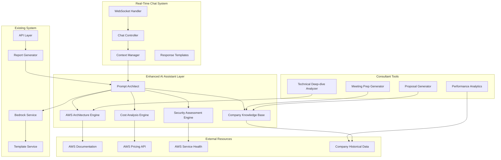

# Design Document

## Overview

The Enhanced Bedrock AI Assistant transforms the existing basic report generator into a sophisticated real-time consulting partner specifically designed for skilled AWS cloud consultants. The system provides instant expert-level responses during client meetings, deep technical analysis that matches consultant expertise, and intelligent tools that understand your company's specific services and methodologies.

**CRITICAL DESIGN PRINCIPLE: These AI-generated responses and analyses are internal tools designed exclusively for cloud consulting business employees/consultants during client engagements. They serve as:**

- **Real-time decision support** during live client meetings and calls
- **Expert-level technical analysis** that matches the sophistication of experienced AWS consultants
- **Company-specific intelligence** that understands your business model, services, and past project patterns
- **Consultant productivity tools** that enhance meeting preparation and follow-up activities

**The system's primary value is enabling consultants to provide more authoritative, specific, and valuable responses to clients in real-time, while maintaining the consultant's role as the trusted advisor.**

The enhanced system introduces a real-time chat interface integrated into the admin dashboard, advanced AWS architecture analysis capabilities, and consultant productivity tools while maintaining backward compatibility with existing report generation features.

## Architecture

### High-Level Architecture



### Component Architecture

The enhanced system introduces several new components while maintaining backward compatibility:

1. **Prompt Architect**: Orchestrates the creation of sophisticated, context-aware prompts
2. **Knowledge Base**: Maintains structured information about cloud services, best practices, and industry requirements
3. **Multi-Cloud Analyzer**: Provides comparative analysis across cloud providers
4. **Risk Assessor**: Identifies potential risks and mitigation strategies
5. **Interview Preparer**: Generates customized interview guides and question sets
6. **Cloud Provider Adapter**: Interfaces with multiple cloud provider documentation systems
7. **Industry Knowledge Base**: Maintains industry-specific compliance and architectural patterns
8. **Documentation Reference Library**: Manages and validates links to official documentation

## Components and Interfaces

### Enhanced Report Generator

The existing report generator will be enhanced with new capabilities while maintaining the current interface:

```go
type EnhancedReportGenerator interface {
    // Existing methods
    GenerateReport(ctx context.Context, inquiry *domain.Inquiry) (*domain.Report, error)
    GenerateHTML(ctx context.Context, inquiry *domain.Inquiry, report *domain.Report) (string, error)
    GeneratePDF(ctx context.Context, inquiry *domain.Inquiry, report *domain.Report) ([]byte, error)
    
    // New methods
    GenerateInterviewGuide(ctx context.Context, inquiry *domain.Inquiry) (*InterviewGuide, error)
    GenerateRiskAssessment(ctx context.Context, inquiry *domain.Inquiry) (*RiskAssessment, error)
    GenerateImplementationRoadmap(ctx context.Context, inquiry *domain.Inquiry, report *domain.Report) (*ImplementationRoadmap, error)
    GenerateCompetitiveAnalysis(ctx context.Context, inquiry *domain.Inquiry) (*CompetitiveAnalysis, error)
}
```

### Prompt Architect

The Prompt Architect is responsible for creating sophisticated, context-aware prompts:

```go
type PromptArchitect interface {
    BuildReportPrompt(ctx context.Context, inquiry *domain.Inquiry, options *PromptOptions) (string, error)
    BuildInterviewPrompt(ctx context.Context, inquiry *domain.Inquiry) (string, error)
    BuildRiskAssessmentPrompt(ctx context.Context, inquiry *domain.Inquiry) (string, error)
    BuildCompetitiveAnalysisPrompt(ctx context.Context, inquiry *domain.Inquiry) (string, error)
    ValidatePrompt(prompt string) error
}

type PromptOptions struct {
    IncludeDocumentationLinks bool
    IncludeCompetitiveAnalysis bool
    IncludeRiskAssessment bool
    IncludeImplementationSteps bool
    TargetAudience string // "technical", "business", "mixed"
    IndustryContext string
    CloudProviders []string
    MaxTokens int
}

type PromptTemplate struct {
    Name string
    Template string
    RequiredVariables []string
    OptionalVariables []string
    ValidationRules []ValidationRule
}
```

### Knowledge Base System

The Knowledge Base maintains structured information about cloud services and best practices:

```go
type KnowledgeBase interface {
    GetCloudServiceInfo(provider, service string) (*CloudServiceInfo, error)
    GetBestPractices(category, provider string) ([]*BestPractice, error)
    GetComplianceRequirements(industry string) ([]*ComplianceRequirement, error)
    GetArchitecturalPatterns(useCase, provider string) ([]*ArchitecturalPattern, error)
    GetDocumentationLinks(provider, topic string) ([]*DocumentationLink, error)
    UpdateKnowledgeBase(ctx context.Context) error
}

type CloudServiceInfo struct {
    Provider string `json:"provider"`
    ServiceName string `json:"service_name"`
    Category string `json:"category"`
    Description string `json:"description"`
    UseCases []string `json:"use_cases"`
    PricingModel string `json:"pricing_model"`
    DocumentationURL string `json:"documentation_url"`
    BestPracticesURL string `json:"best_practices_url"`
    Alternatives map[string]string `json:"alternatives"` // provider -> service mapping
    LastUpdated time.Time `json:"last_updated"`
}

type BestPractice struct {
    ID string `json:"id"`
    Title string `json:"title"`
    Description string `json:"description"`
    Category string `json:"category"`
    Provider string `json:"provider"`
    Industry string `json:"industry,omitempty"`
    DocumentationURL string `json:"documentation_url"`
    Priority string `json:"priority"` // "high", "medium", "low"
    Tags []string `json:"tags"`
}

type ComplianceRequirement struct {
    Framework string `json:"framework"` // "HIPAA", "PCI-DSS", "SOX", etc.
    Industry string `json:"industry"`
    Requirement string `json:"requirement"`
    CloudControls map[string][]string `json:"cloud_controls"` // provider -> controls
    DocumentationURL string `json:"documentation_url"`
    Severity string `json:"severity"`
}
```

### Multi-Cloud Analyzer

Provides comparative analysis across cloud providers:

```go
type MultiCloudAnalyzer interface {
    CompareServices(ctx context.Context, requirement ServiceRequirement) (*ServiceComparison, error)
    AnalyzeCosts(ctx context.Context, workload WorkloadSpec) (*CostAnalysis, error)
    EvaluateProviders(ctx context.Context, criteria EvaluationCriteria) (*ProviderEvaluation, error)
    GetMigrationPaths(ctx context.Context, source, target CloudProvider) (*MigrationPath, error)
}

type ServiceRequirement struct {
    Category string `json:"category"` // "compute", "storage", "database", etc.
    Requirements []string `json:"requirements"`
    Performance PerformanceRequirements `json:"performance"`
    Compliance []string `json:"compliance"`
    Budget BudgetConstraints `json:"budget"`
}

type ServiceComparison struct {
    Category string `json:"category"`
    Providers []ProviderOption `json:"providers"`
    Recommendation string `json:"recommendation"`
    Reasoning string `json:"reasoning"`
    DocumentationLinks []DocumentationLink `json:"documentation_links"`
}

type ProviderOption struct {
    Provider string `json:"provider"`
    ServiceName string `json:"service_name"`
    Pros []string `json:"pros"`
    Cons []string `json:"cons"`
    EstimatedCost string `json:"estimated_cost"`
    DocumentationURL string `json:"documentation_url"`
    ImplementationComplexity string `json:"implementation_complexity"`
}
```

### Risk Assessor

Identifies and analyzes potential risks:

```go
type RiskAssessor interface {
    AssessRisks(ctx context.Context, inquiry *domain.Inquiry, solution *ProposedSolution) (*RiskAssessment, error)
    IdentifySecurityRisks(ctx context.Context, architecture *Architecture) ([]*SecurityRisk, error)
    EvaluateComplianceRisks(ctx context.Context, industry string, solution *ProposedSolution) ([]*ComplianceRisk, error)
    GenerateMitigationStrategies(ctx context.Context, risks []*Risk) ([]*MitigationStrategy, error)
}

type RiskAssessment struct {
    OverallRiskLevel string `json:"overall_risk_level"` // "low", "medium", "high", "critical"
    TechnicalRisks []*TechnicalRisk `json:"technical_risks"`
    SecurityRisks []*SecurityRisk `json:"security_risks"`
    ComplianceRisks []*ComplianceRisk `json:"compliance_risks"`
    BusinessRisks []*BusinessRisk `json:"business_risks"`
    MitigationStrategies []*MitigationStrategy `json:"mitigation_strategies"`
    RecommendedActions []string `json:"recommended_actions"`
}

type Risk struct {
    ID string `json:"id"`
    Category string `json:"category"`
    Title string `json:"title"`
    Description string `json:"description"`
    Impact string `json:"impact"` // "low", "medium", "high", "critical"
    Probability string `json:"probability"` // "low", "medium", "high"
    RiskScore int `json:"risk_score"` // calculated from impact and probability
    AffectedComponents []string `json:"affected_components"`
    DocumentationURL string `json:"documentation_url,omitempty"`
}

type MitigationStrategy struct {
    RiskID string `json:"risk_id"`
    Strategy string `json:"strategy"`
    ImplementationSteps []string `json:"implementation_steps"`
    EstimatedEffort string `json:"estimated_effort"`
    Cost string `json:"cost"`
    Priority string `json:"priority"`
    DocumentationURL string `json:"documentation_url,omitempty"`
}
```

### Interview Preparer

Generates customized interview guides and question sets:

```go
type InterviewPreparer interface {
    GenerateInterviewGuide(ctx context.Context, inquiry *domain.Inquiry) (*InterviewGuide, error)
    GenerateQuestionSet(ctx context.Context, category string, industry string) (*QuestionSet, error)
    GenerateDiscoveryChecklist(ctx context.Context, serviceType string) (*DiscoveryChecklist, error)
    GenerateFollowUpQuestions(ctx context.Context, responses []InterviewResponse) ([]*Question, error)
}

type InterviewGuide struct {
    ID string `json:"id"`
    InquiryID string `json:"inquiry_id"`
    Title string `json:"title"`
    Objective string `json:"objective"`
    EstimatedDuration string `json:"estimated_duration"`
    PreparationNotes []string `json:"preparation_notes"`
    Sections []InterviewSection `json:"sections"`
    FollowUpActions []string `json:"follow_up_actions"`
    CreatedAt time.Time `json:"created_at"`
}

type InterviewSection struct {
    Title string `json:"title"`
    Objective string `json:"objective"`
    Questions []*Question `json:"questions"`
    ExpectedDuration string `json:"expected_duration"`
    Notes []string `json:"notes"`
}

type Question struct {
    ID string `json:"id"`
    Text string `json:"text"`
    Type string `json:"type"` // "open", "closed", "technical", "business"
    Category string `json:"category"`
    Priority string `json:"priority"` // "must-ask", "should-ask", "nice-to-ask"
    FollowUpQuestions []string `json:"follow_up_questions"`
    ExpectedAnswerType string `json:"expected_answer_type"`
    ValidationCriteria []string `json:"validation_criteria"`
}

type DiscoveryChecklist struct {
    ServiceType string `json:"service_type"`
    RequiredArtifacts []Artifact `json:"required_artifacts"`
    TechnicalRequirements []string `json:"technical_requirements"`
    BusinessRequirements []string `json:"business_requirements"`
    ComplianceRequirements []string `json:"compliance_requirements"`
    EnvironmentDetails []string `json:"environment_details"`
}

type Artifact struct {
    Name string `json:"name"`
    Description string `json:"description"`
    Type string `json:"type"` // "document", "diagram", "data", "access"
    Priority string `json:"priority"`
    Format []string `json:"format"`
    Source string `json:"source"`
}
```

### Documentation Reference Library

Manages and validates links to official documentation:

```go
type DocumentationLibrary interface {
    GetDocumentationLinks(ctx context.Context, provider, topic string) ([]*DocumentationLink, error)
    ValidateLinks(ctx context.Context, links []*DocumentationLink) ([]*LinkValidation, error)
    UpdateDocumentationIndex(ctx context.Context) error
    SearchDocumentation(ctx context.Context, query string, providers []string) ([]*DocumentationLink, error)
}

type DocumentationLink struct {
    ID string `json:"id"`
    Provider string `json:"provider"`
    Topic string `json:"topic"`
    Title string `json:"title"`
    URL string `json:"url"`
    Description string `json:"description"`
    Type string `json:"type"` // "guide", "reference", "tutorial", "best-practice"
    LastValidated time.Time `json:"last_validated"`
    IsValid bool `json:"is_valid"`
    Tags []string `json:"tags"`
}

type LinkValidation struct {
    LinkID string `json:"link_id"`
    URL string `json:"url"`
    IsValid bool `json:"is_valid"`
    StatusCode int `json:"status_code"`
    Error string `json:"error,omitempty"`
    ValidatedAt time.Time `json:"validated_at"`
}
```

## Data Models

### Enhanced Report Structure

The existing report model will be extended with new fields:

```go
type EnhancedReport struct {
    // Existing fields
    ID          string          `json:"id"`
    InquiryID   string          `json:"inquiry_id"`
    Type        ReportType      `json:"type"`
    Title       string          `json:"title"`
    Content     string          `json:"content"`
    Status      ReportStatus    `json:"status"`
    GeneratedBy string          `json:"generated_by"`
    CreatedAt   time.Time       `json:"created_at"`
    UpdatedAt   time.Time       `json:"updated_at"`
    
    // New fields
    CloudProviders []string `json:"cloud_providers"`
    IndustryContext string `json:"industry_context"`
    TargetAudience string `json:"target_audience"`
    DocumentationLinks []*DocumentationLink `json:"documentation_links"`
    RiskAssessment *RiskAssessment `json:"risk_assessment,omitempty"`
    InterviewGuide *InterviewGuide `json:"interview_guide,omitempty"`
    ImplementationRoadmap *ImplementationRoadmap `json:"implementation_roadmap,omitempty"`
    CompetitiveAnalysis *CompetitiveAnalysis `json:"competitive_analysis,omitempty"`
    Metadata ReportMetadata `json:"metadata"`
}

type ReportMetadata struct {
    TokensUsed int `json:"tokens_used"`
    GenerationTime time.Duration `json:"generation_time"`
    PromptVersion string `json:"prompt_version"`
    KnowledgeBaseVersion string `json:"knowledge_base_version"`
    QualityScore float64 `json:"quality_score"`
    ReviewRequired bool `json:"review_required"`
}
```

### Implementation Roadmap

```go
type ImplementationRoadmap struct {
    ID string `json:"id"`
    Title string `json:"title"`
    Overview string `json:"overview"`
    TotalDuration string `json:"total_duration"`
    EstimatedCost string `json:"estimated_cost"`
    Phases []RoadmapPhase `json:"phases"`
    Dependencies []Dependency `json:"dependencies"`
    Risks []string `json:"risks"`
    SuccessMetrics []string `json:"success_metrics"`
    CreatedAt time.Time `json:"created_at"`
}

type RoadmapPhase struct {
    ID string `json:"id"`
    Name string `json:"name"`
    Description string `json:"description"`
    Duration string `json:"duration"`
    EstimatedCost string `json:"estimated_cost"`
    Prerequisites []string `json:"prerequisites"`
    Deliverables []Deliverable `json:"deliverables"`
    Tasks []Task `json:"tasks"`
    Milestones []Milestone `json:"milestones"`
    ResourceRequirements ResourceRequirements `json:"resource_requirements"`
}

type Task struct {
    ID string `json:"id"`
    Name string `json:"name"`
    Description string `json:"description"`
    EstimatedHours int `json:"estimated_hours"`
    SkillsRequired []string `json:"skills_required"`
    Dependencies []string `json:"dependencies"`
    Priority string `json:"priority"`
    DocumentationLinks []string `json:"documentation_links"`
}

type ResourceRequirements struct {
    TechnicalRoles []Role `json:"technical_roles"`
    BusinessRoles []Role `json:"business_roles"`
    ExternalServices []string `json:"external_services"`
    Tools []string `json:"tools"`
    Budget string `json:"budget"`
}
```

### Competitive Analysis

```go
type CompetitiveAnalysis struct {
    ID string `json:"id"`
    Title string `json:"title"`
    UseCase string `json:"use_case"`
    ProvidersAnalyzed []string `json:"providers_analyzed"`
    ComparisonMatrix []ComparisonRow `json:"comparison_matrix"`
    Recommendations []Recommendation `json:"recommendations"`
    CostComparison *CostComparison `json:"cost_comparison"`
    FeatureComparison *FeatureComparison `json:"feature_comparison"`
    Summary string `json:"summary"`
    CreatedAt time.Time `json:"created_at"`
}

type ComparisonRow struct {
    Criteria string `json:"criteria"`
    Weight float64 `json:"weight"`
    Scores map[string]float64 `json:"scores"` // provider -> score
    Notes map[string]string `json:"notes"` // provider -> notes
}

type Recommendation struct {
    Provider string `json:"provider"`
    Scenario string `json:"scenario"`
    Reasoning string `json:"reasoning"`
    Confidence string `json:"confidence"`
    DocumentationLinks []string `json:"documentation_links"`
}
```

## Error Handling

### Enhanced Error Types

```go
type AIAssistantError struct {
    Code string `json:"code"`
    Message string `json:"message"`
    Component string `json:"component"`
    Details map[string]interface{} `json:"details"`
    Retryable bool `json:"retryable"`
    DocumentationURL string `json:"documentation_url,omitempty"`
}

// Error codes specific to AI assistant
const (
    ErrCodeKnowledgeBaseUnavailable = "KNOWLEDGE_BASE_UNAVAILABLE"
    ErrCodeDocumentationLinkInvalid = "DOCUMENTATION_LINK_INVALID"
    ErrCodePromptGenerationFailed = "PROMPT_GENERATION_FAILED"
    ErrCodeRiskAssessmentFailed = "RISK_ASSESSMENT_FAILED"
    ErrCodeCompetitiveAnalysisFailed = "COMPETITIVE_ANALYSIS_FAILED"
    ErrCodeInterviewGuideGenerationFailed = "INTERVIEW_GUIDE_GENERATION_FAILED"
)
```

### Fallback Strategies

1. **Knowledge Base Unavailable**: Fall back to basic prompts without enhanced context
2. **Documentation Links Invalid**: Generate reports without links but note the limitation
3. **Risk Assessment Failed**: Generate basic reports with a note about missing risk analysis
4. **Competitive Analysis Failed**: Focus on single-provider recommendations
5. **Interview Guide Generation Failed**: Provide basic question templates

## Testing Strategy

### Testing Approach

1. **Unit Tests (70%)**
   - Prompt generation logic
   - Knowledge base queries
   - Risk assessment algorithms
   - Documentation link validation

2. **Integration Tests (20%)**
   - Bedrock API integration with enhanced prompts
   - Knowledge base integration
   - Multi-cloud analysis workflows
   - End-to-end report generation

3. **Quality Tests (10%)**
   - Report quality assessment
   - Documentation link accuracy
   - Prompt effectiveness evaluation
   - User acceptance testing with real consultants

### Test Data Strategy

```go
type TestScenario struct {
    Name string
    Inquiry *domain.Inquiry
    ExpectedProviders []string
    ExpectedDocumentationLinks int
    ExpectedRiskLevel string
    ExpectedInterviewQuestions int
    QualityThreshold float64
}

var testScenarios = []TestScenario{
    {
        Name: "Healthcare HIPAA Migration",
        Inquiry: &domain.Inquiry{
            Company: "Regional Hospital",
            Services: []string{"migration"},
            Message: "Need to migrate patient data to cloud with HIPAA compliance",
        },
        ExpectedProviders: []string{"AWS", "Azure", "GCP"},
        ExpectedDocumentationLinks: 5,
        ExpectedRiskLevel: "high",
        ExpectedInterviewQuestions: 15,
        QualityThreshold: 0.8,
    },
    // More test scenarios...
}
```

### Quality Metrics

```go
type QualityMetrics struct {
    DocumentationLinkAccuracy float64 `json:"documentation_link_accuracy"`
    RecommendationSpecificity float64 `json:"recommendation_specificity"`
    RiskAssessmentCompleteness float64 `json:"risk_assessment_completeness"`
    InterviewGuideRelevance float64 `json:"interview_guide_relevance"`
    MultiCloudCoverage float64 `json:"multi_cloud_coverage"`
    IndustrySpecificityScore float64 `json:"industry_specificity_score"`
}
```

## Implementation Considerations

### Prompt Engineering Strategy

The system will use a sophisticated prompt engineering approach:

1. **Structured Prompts**: Use consistent templates with variable substitution
2. **Context Injection**: Dynamically inject relevant knowledge base information
3. **Chain-of-Thought**: Guide the AI through structured reasoning processes
4. **Few-Shot Learning**: Include examples of high-quality outputs
5. **Constraint Specification**: Clearly specify output format and requirements

### Knowledge Base Management

1. **Automated Updates**: Regular scraping of cloud provider documentation
2. **Version Control**: Track changes in cloud services and best practices
3. **Quality Assurance**: Validate information accuracy and relevance
4. **Caching Strategy**: Cache frequently accessed information for performance
5. **Fallback Mechanisms**: Handle cases where knowledge base is unavailable

### Performance Optimization

1. **Parallel Processing**: Generate different report sections concurrently
2. **Caching**: Cache generated content for similar inquiries
3. **Streaming**: Stream responses for long-running generations
4. **Rate Limiting**: Manage Bedrock API usage efficiently
5. **Quality vs Speed**: Balance comprehensive analysis with response time

### Security and Privacy

1. **Data Sanitization**: Remove sensitive information from prompts
2. **Access Control**: Restrict access to enhanced features based on permissions
3. **Audit Logging**: Track all AI-generated content and decisions
4. **Compliance**: Ensure generated content meets industry compliance requirements
5. **Data Retention**: Manage retention of generated content and analysis data