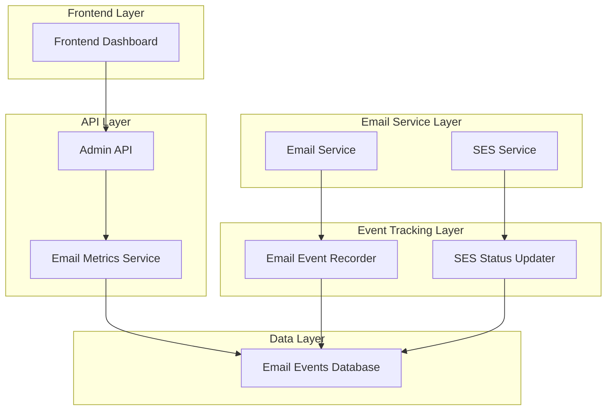

# Design Document

## Overview

This design implements a comprehensive email monitoring system that replaces mock data with real email metrics collected from actual email service operations. The solution integrates with the existing email service architecture and provides persistent storage for email events, real-time metrics calculation, and enhanced API endpoints for the admin dashboard.

## Architecture

### High-Level Architecture



### Database Schema

The email tracking system will use a new `email_events` table:

```sql
CREATE TABLE email_events (
    id UUID PRIMARY KEY DEFAULT gen_random_uuid(),
    inquiry_id VARCHAR(255) NOT NULL,
    email_type VARCHAR(50) NOT NULL, -- 'customer_confirmation', 'consultant_notification', 'inquiry_notification'
    recipient_email VARCHAR(255) NOT NULL,
    sender_email VARCHAR(255) NOT NULL,
    subject VARCHAR(500),
    status VARCHAR(50) NOT NULL, -- 'sent', 'delivered', 'failed', 'bounced', 'spam'
    sent_at TIMESTAMP WITH TIME ZONE NOT NULL,
    delivered_at TIMESTAMP WITH TIME ZONE,
    error_message TEXT,
    bounce_type VARCHAR(50), -- 'permanent', 'temporary', 'complaint'
    ses_message_id VARCHAR(255),
    created_at TIMESTAMP WITH TIME ZONE DEFAULT NOW(),
    updated_at TIMESTAMP WITH TIME ZONE DEFAULT NOW()
);

CREATE INDEX idx_email_events_inquiry_id ON email_events(inquiry_id);
CREATE INDEX idx_email_events_status ON email_events(status);
CREATE INDEX idx_email_events_sent_at ON email_events(sent_at);
CREATE INDEX idx_email_events_email_type ON email_events(email_type);
```

## Components and Interfaces

### 1. Email Event Recorder

**Purpose**: Records email events when emails are sent through the email service

**Interface**: `interfaces.EmailEventRecorder`

```go
type EmailEventRecorder interface {
    RecordEmailSent(ctx context.Context, event *EmailEvent) error
    UpdateEmailStatus(ctx context.Context, messageID string, status EmailEventStatus, deliveredAt *time.Time, errorMsg string) error
    GetEmailEventsByInquiry(ctx context.Context, inquiryID string) ([]*EmailEvent, error)
}

type EmailEvent struct {
    ID              string
    InquiryID       string
    EmailType       EmailEventType
    RecipientEmail  string
    SenderEmail     string
    Subject         string
    Status          EmailEventStatus
    SentAt          time.Time
    DeliveredAt     *time.Time
    ErrorMessage    string
    BounceType      string
    SESMessageID    string
}

type EmailEventType string
const (
    EmailTypeCustomerConfirmation EmailEventType = "customer_confirmation"
    EmailTypeConsultantNotification EmailEventType = "consultant_notification"
    EmailTypeInquiryNotification EmailEventType = "inquiry_notification"
)

type EmailEventStatus string
const (
    EmailStatusSent      EmailEventStatus = "sent"
    EmailStatusDelivered EmailEventStatus = "delivered"
    EmailStatusFailed    EmailEventStatus = "failed"
    EmailStatusBounced   EmailEventStatus = "bounced"
    EmailStatusSpam      EmailEventStatus = "spam"
)
```

### 2. Email Metrics Service

**Purpose**: Calculates real-time email metrics from recorded events

**Interface**: `interfaces.EmailMetricsService`

```go
type EmailMetricsService interface {
    GetEmailMetrics(ctx context.Context, timeRange TimeRange) (*EmailMetrics, error)
    GetEmailStatusByInquiry(ctx context.Context, inquiryID string) (*EmailStatus, error)
    GetEmailEventHistory(ctx context.Context, filters EmailEventFilters) ([]*EmailEvent, error)
}

type EmailMetrics struct {
    TotalEmails     int64   `json:"total_emails"`
    DeliveredEmails int64   `json:"delivered_emails"`
    FailedEmails    int64   `json:"failed_emails"`
    BouncedEmails   int64   `json:"bounced_emails"`
    SpamEmails      int64   `json:"spam_emails"`
    DeliveryRate    float64 `json:"delivery_rate"`
    BounceRate      float64 `json:"bounce_rate"`
    SpamRate        float64 `json:"spam_rate"`
    TimeRange       string  `json:"time_range"`
}

type TimeRange struct {
    Start time.Time
    End   time.Time
}

type EmailEventFilters struct {
    TimeRange   *TimeRange
    EmailType   *EmailEventType
    Status      *EmailEventStatus
    InquiryID   *string
    Limit       int
    Offset      int
}
```

### 3. Enhanced Email Service

**Purpose**: Integrate email event recording into existing email service operations

The existing email service will be enhanced to record events:

```go
// Enhanced SendReportEmail method
func (e *emailService) SendReportEmail(ctx context.Context, inquiry *domain.Inquiry, report *domain.Report) error {
    // Create email event record
    event := &EmailEvent{
        InquiryID:      inquiry.ID,
        EmailType:      EmailTypeConsultantNotification,
        RecipientEmail: e.config.SenderEmail, // Internal email
        SenderEmail:    e.config.SenderEmail,
        Subject:        fmt.Sprintf("New Report Generated - %s", inquiry.Company),
        Status:         EmailStatusSent,
        SentAt:         time.Now(),
    }
    
    // Send email via SES
    err := e.sesService.SendEmail(ctx, email)
    if err != nil {
        // Record failed event
        event.Status = EmailStatusFailed
        event.ErrorMessage = err.Error()
        e.eventRecorder.RecordEmailSent(ctx, event)
        return err
    }
    
    // Record successful send
    event.SESMessageID = email.MessageID // Assuming SES returns message ID
    e.eventRecorder.RecordEmailSent(ctx, event)
    
    return nil
}
```

### 4. SES Status Updater

**Purpose**: Update email event status based on SES delivery confirmations

```go
type SESStatusUpdater interface {
    ProcessSESNotification(ctx context.Context, notification *SESNotification) error
    UpdateDeliveryStatus(ctx context.Context, messageID string, status string) error
}

type SESNotification struct {
    MessageID    string
    EventType    string // 'delivery', 'bounce', 'complaint'
    Timestamp    time.Time
    BounceType   string
    ErrorMessage string
}
```

### 5. Enhanced Admin Handler

**Purpose**: Provide real email metrics through API endpoints

```go
// Enhanced GetSystemMetrics method
func (h *AdminHandler) GetSystemMetrics(c *gin.Context) {
    // Get time range from query params
    timeRange := parseTimeRange(c.Query("time_range"))
    
    // Get real email metrics
    emailMetrics, err := h.emailMetricsService.GetEmailMetrics(c.Request.Context(), timeRange)
    if err != nil {
        h.logger.WithError(err).Error("Failed to get email metrics")
        // Return error instead of mock data
        c.JSON(http.StatusInternalServerError, gin.H{
            "success": false,
            "error":   "Failed to retrieve email metrics",
        })
        return
    }
    
    // Calculate other system metrics...
    metrics := SystemMetrics{
        TotalInquiries:    totalInquiries,
        ReportsGenerated:  reportsGenerated,
        EmailsSent:        emailMetrics.TotalEmails,
        EmailDeliveryRate: emailMetrics.DeliveryRate,
        // ... other metrics
    }
    
    c.JSON(http.StatusOK, gin.H{
        "success": true,
        "data":    metrics,
    })
}

// Enhanced GetEmailStatus method
func (h *AdminHandler) GetEmailStatus(c *gin.Context) {
    inquiryID := c.Param("inquiryId")
    
    // Get real email status from events
    emailStatus, err := h.emailMetricsService.GetEmailStatusByInquiry(c.Request.Context(), inquiryID)
    if err != nil {
        h.logger.WithError(err).Error("Failed to get email status")
        c.JSON(http.StatusInternalServerError, gin.H{
            "success": false,
            "error":   "Failed to retrieve email status",
        })
        return
    }
    
    if emailStatus == nil {
        c.JSON(http.StatusNotFound, gin.H{
            "success": false,
            "error":   "No email events found for this inquiry",
        })
        return
    }
    
    c.JSON(http.StatusOK, gin.H{
        "success": true,
        "data":    emailStatus,
    })
}
```

## Data Models

### Email Event Repository

```go
type EmailEventRepository interface {
    Create(ctx context.Context, event *EmailEvent) error
    Update(ctx context.Context, event *EmailEvent) error
    GetByInquiryID(ctx context.Context, inquiryID string) ([]*EmailEvent, error)
    GetByMessageID(ctx context.Context, messageID string) (*EmailEvent, error)
    GetMetrics(ctx context.Context, filters EmailEventFilters) (*EmailMetrics, error)
    List(ctx context.Context, filters EmailEventFilters) ([]*EmailEvent, error)
}
```

### Database Implementation

```go
type emailEventRepository struct {
    db     *sql.DB
    logger *logrus.Logger
}

func (r *emailEventRepository) Create(ctx context.Context, event *EmailEvent) error {
    query := `
        INSERT INTO email_events (
            inquiry_id, email_type, recipient_email, sender_email, 
            subject, status, sent_at, delivered_at, error_message, 
            bounce_type, ses_message_id
        ) VALUES ($1, $2, $3, $4, $5, $6, $7, $8, $9, $10, $11)
        RETURNING id, created_at, updated_at
    `
    
    err := r.db.QueryRowContext(ctx, query,
        event.InquiryID, event.EmailType, event.RecipientEmail,
        event.SenderEmail, event.Subject, event.Status,
        event.SentAt, event.DeliveredAt, event.ErrorMessage,
        event.BounceType, event.SESMessageID,
    ).Scan(&event.ID, &event.CreatedAt, &event.UpdatedAt)
    
    return err
}

func (r *emailEventRepository) GetMetrics(ctx context.Context, filters EmailEventFilters) (*EmailMetrics, error) {
    query := `
        SELECT 
            COUNT(*) as total_emails,
            COUNT(CASE WHEN status = 'delivered' THEN 1 END) as delivered_emails,
            COUNT(CASE WHEN status = 'failed' THEN 1 END) as failed_emails,
            COUNT(CASE WHEN status = 'bounced' THEN 1 END) as bounced_emails,
            COUNT(CASE WHEN status = 'spam' THEN 1 END) as spam_emails
        FROM email_events 
        WHERE sent_at >= $1 AND sent_at <= $2
    `
    
    var metrics EmailMetrics
    err := r.db.QueryRowContext(ctx, query, filters.TimeRange.Start, filters.TimeRange.End).Scan(
        &metrics.TotalEmails,
        &metrics.DeliveredEmails,
        &metrics.FailedEmails,
        &metrics.BouncedEmails,
        &metrics.SpamEmails,
    )
    
    if err != nil {
        return nil, err
    }
    
    // Calculate rates
    if metrics.TotalEmails > 0 {
        metrics.DeliveryRate = float64(metrics.DeliveredEmails) / float64(metrics.TotalEmails) * 100
        metrics.BounceRate = float64(metrics.BouncedEmails) / float64(metrics.TotalEmails) * 100
        metrics.SpamRate = float64(metrics.SpamEmails) / float64(metrics.TotalEmails) * 100
    }
    
    return &metrics, nil
}
```

## Error Handling

### Email Event Recording Failures

1. **Non-blocking**: Email event recording failures should not prevent email delivery
2. **Retry Logic**: Implement retry mechanism for transient database failures
3. **Fallback Logging**: Log email events to files if database is unavailable
4. **Monitoring**: Alert on high email event recording failure rates

### API Error Handling

1. **Graceful Degradation**: Return appropriate error messages instead of mock data
2. **Partial Data**: Handle cases where some email data is available
3. **Timeout Handling**: Implement timeouts for database queries
4. **Circuit Breaker**: Prevent cascading failures in email metrics service

## Testing Strategy

### Unit Tests

1. **Email Event Recorder**: Test event recording with various email types and statuses
2. **Email Metrics Service**: Test metrics calculation with different time ranges and filters
3. **Repository Layer**: Test database operations with mock data
4. **Enhanced Email Service**: Test integration with event recording

### Integration Tests

1. **End-to-End Email Flow**: Test complete email sending and event recording
2. **API Endpoints**: Test enhanced admin endpoints with real data
3. **Database Integration**: Test with real database connections
4. **SES Integration**: Test with SES sandbox environment

### Performance Tests

1. **High Volume Email Events**: Test system with large numbers of email events
2. **Metrics Calculation**: Test performance of metrics queries with large datasets
3. **Concurrent Access**: Test concurrent email sending and event recording
4. **Database Performance**: Test query performance with proper indexing

## Migration Strategy

### Phase 1: Database Setup
1. Create email_events table and indexes
2. Implement email event repository
3. Add database migration scripts

### Phase 2: Event Recording
1. Implement email event recorder service
2. Integrate with existing email service
3. Test event recording without affecting current functionality

### Phase 3: Metrics Service
1. Implement email metrics service
2. Create enhanced API endpoints
3. Test metrics calculation accuracy

### Phase 4: Frontend Integration
1. Update V0DataAdapter to use real data APIs
2. Remove mock data fallbacks
3. Update error handling in dashboard components

### Phase 5: SES Integration
1. Implement SES status updater
2. Set up SES webhooks or polling
3. Test delivery status updates

## Security Considerations

1. **Data Privacy**: Ensure email content is not stored unnecessarily
2. **Access Control**: Restrict email metrics access to admin users only
3. **Data Retention**: Implement retention policies for email events
4. **Audit Logging**: Log access to email metrics and events
5. **Sensitive Data**: Avoid storing sensitive information in email events

## Performance Considerations

1. **Database Indexing**: Proper indexes on frequently queried columns
2. **Query Optimization**: Efficient queries for metrics calculation
3. **Caching**: Cache frequently accessed metrics
4. **Batch Processing**: Batch email event updates for better performance
5. **Archiving**: Archive old email events to maintain performance