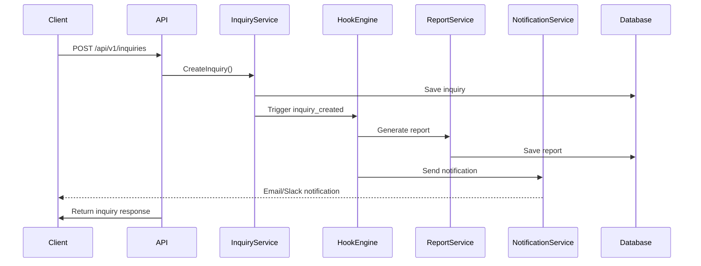
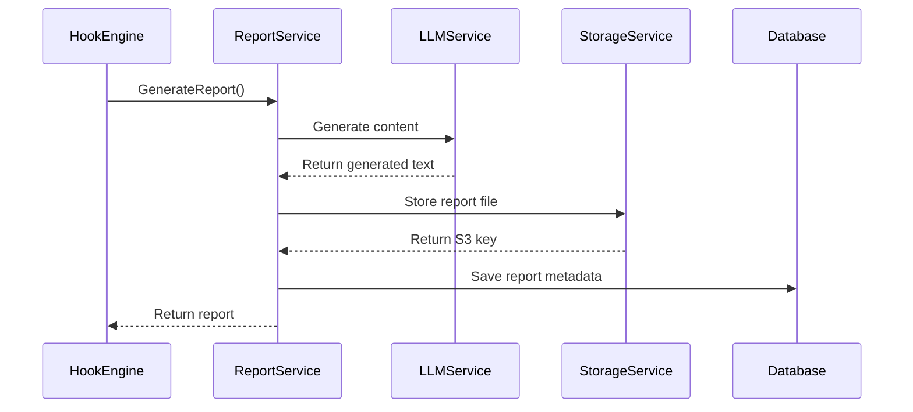

# Architecture Documentation

This document describes the architecture and design decisions for the Cloud Consulting Backend system.

## System Overview

The Cloud Consulting Backend is a Go-based microservice that processes service inquiries, generates AI-powered reports, and manages consultant notifications. It follows clean architecture principles with clear separation of concerns.

## Architecture Patterns

### Layered Architecture

The system is organized into distinct layers:

```
┌─────────────────────────────────────┐
│           API Layer                 │
│  (HTTP Handlers & Middleware)       │
├─────────────────────────────────────┤
│         Service Layer               │
│     (Business Logic)                │
├─────────────────────────────────────┤
│       Repository Layer              │
│      (Data Access)                  │
├─────────────────────────────────────┤
│      Infrastructure Layer           │
│  (External Services & Database)     │
└─────────────────────────────────────┘
```

### Dependency Injection

The system uses interface-based dependency injection to:
- Enable easy testing with mocks
- Reduce coupling between components
- Support different implementations (e.g., different databases)

### Repository Pattern

Data access is abstracted through repository interfaces:
- `InquiryRepository` - Inquiry data operations
- `ReportRepository` - Report data operations  
- `ActivityRepository` - Activity logging operations

### Service Pattern

Business logic is encapsulated in service interfaces:
- `InquiryService` - Inquiry management
- `ReportService` - Report generation and management
- `NotificationService` - Notification handling
- `AgentHooksService` - Hook execution

## Component Architecture

### Core Components

#### 1. HTTP Server (Gin)
- Handles HTTP requests and responses
- Implements middleware for CORS, logging, rate limiting
- Routes requests to appropriate handlers

#### 2. Business Services
- **InquiryService**: Manages inquiry lifecycle
- **ReportService**: Handles AI report generation
- **NotificationService**: Sends notifications to consultants
- **AgentHooksService**: Executes automated workflows

#### 3. Data Layer
- **PostgreSQL**: Primary data store for inquiries, reports, activities
- **Redis**: Caching and session management
- **GORM**: ORM for database operations

#### 4. External Integrations
- **LLM Service**: AI report generation (OpenAI/Anthropic)
- **S3**: File storage for reports and documents
- **SQS**: Message queuing for async processing
- **Email/Slack**: Notification channels

### Agent Hooks System

The Agent Hooks system provides extensible automation:

```
┌─────────────────┐    ┌─────────────────┐    ┌─────────────────┐
│   Trigger       │───▶│  Hook Engine    │───▶│  Hook Handler   │
│  (Event)        │    │                 │    │                 │
└─────────────────┘    └─────────────────┘    └─────────────────┘
                              │
                              ▼
                       ┌─────────────────┐
                       │   Execution     │
                       │    Context      │
                       └─────────────────┘
```

#### Hook Types
- `inquiry_created` - Triggered when new inquiry is received
- `report_generated` - Triggered when report is generated
- `status_changed` - Triggered when inquiry status changes
- `notification_sent` - Triggered after notification delivery

## Data Flow

### Inquiry Processing Flow



### Report Generation Flow



## Security Architecture

### Authentication & Authorization
- JWT-based authentication (optional)
- Role-based access control (RBAC)
- API key authentication for external services

### Data Protection
- TLS encryption in transit
- Database encryption at rest
- Input validation and sanitization
- SQL injection prevention via GORM

### Rate Limiting
- Per-IP rate limiting
- Per-user rate limiting (when authenticated)
- Configurable limits and burst capacity

## Scalability Considerations

### Horizontal Scaling
- Stateless application design
- Load balancer distribution
- Database connection pooling
- Redis for shared state

### Performance Optimization
- Database indexing strategy
- Query optimization
- Caching frequently accessed data
- Async processing for heavy operations

### Resource Management
- Connection pool management
- Memory usage monitoring
- Graceful shutdown handling
- Circuit breaker pattern for external services

## Monitoring & Observability

### Metrics Collection
- Prometheus metrics for all operations
- Custom business metrics (inquiries, reports, notifications)
- Performance metrics (latency, throughput, error rates)

### Logging Strategy
- Structured JSON logging
- Correlation IDs for request tracing
- Different log levels (DEBUG, INFO, WARN, ERROR)
- Sensitive data filtering

### Health Checks
- Database connectivity
- External service availability
- Memory and CPU usage
- Custom health indicators

## Error Handling

### Error Categories
1. **Validation Errors** - Invalid input data
2. **Business Logic Errors** - Domain rule violations
3. **Infrastructure Errors** - Database, network, external service failures
4. **System Errors** - Unexpected runtime errors

### Error Response Strategy
- Consistent error response format
- Appropriate HTTP status codes
- Detailed error messages for debugging
- Error correlation with trace IDs

### Resilience Patterns
- **Circuit Breaker** - Prevent cascading failures
- **Retry Logic** - Handle transient failures
- **Timeout Handling** - Prevent hanging requests
- **Graceful Degradation** - Continue operation with reduced functionality

## Configuration Management

### Environment-Based Configuration
- Development, staging, production environments
- Environment variable configuration
- Configuration validation at startup
- Feature flags for gradual rollouts

### Secrets Management
- AWS Secrets Manager integration
- Environment variable encryption
- Secure credential rotation
- Audit logging for secret access

## Deployment Architecture

### AWS Infrastructure
```
┌─────────────────────────────────────────────────────────────┐
│                        AWS Account                          │
│  ┌─────────────────────────────────────────────────────────┐│
│  │                      VPC                                ││
│  │  ┌─────────────────┐    ┌─────────────────────────────┐ ││
│  │  │  Public Subnet  │    │      Private Subnet         │ ││
│  │  │                 │    │                             │ ││
│  │  │  ┌───────────┐  │    │  ┌─────────────────────────┐│ ││
│  │  │  │    ALB    │  │    │  │      ECS Fargate        ││ ││
│  │  │  └───────────┘  │    │  │    (API Containers)     ││ ││
│  │  │                 │    │  └─────────────────────────┘│ ││
│  │  │  ┌───────────┐  │    │                             │ ││
│  │  │  │ NAT Gateway│  │    │  ┌─────────────────────────┐│ ││
│  │  │  └───────────┘  │    │  │    RDS PostgreSQL       ││ ││
│  │  └─────────────────┘    │  └─────────────────────────┘│ ││
│  │                         │                             │ ││
│  │                         │  ┌─────────────────────────┐│ ││
│  │                         │  │   ElastiCache Redis     ││ ││
│  │                         │  └─────────────────────────┘│ ││
│  └─────────────────────────────────────────────────────────┘│
│                                                             │
│  ┌─────────────┐  ┌─────────────┐  ┌─────────────────────┐ │
│  │     S3      │  │     SQS     │  │    CloudWatch       │ │
│  │   Storage   │  │   Queues    │  │   Logs & Metrics    │ │
│  └─────────────┘  └─────────────┘  └─────────────────────┘ │
└─────────────────────────────────────────────────────────────┘
```

### Container Strategy
- Multi-stage Docker builds for optimization
- Container health checks
- Resource limits and requests
- Auto-scaling based on metrics

## Future Considerations

### Extensibility
- Plugin architecture for new service types
- Webhook system for external integrations
- API versioning strategy
- Database schema evolution

### Performance Enhancements
- Read replicas for database scaling
- CDN for static content delivery
- Advanced caching strategies
- Query optimization and indexing

### Additional Features
- Real-time notifications via HTTP polling
- Advanced analytics and reporting
- Multi-tenant architecture
- Internationalization support